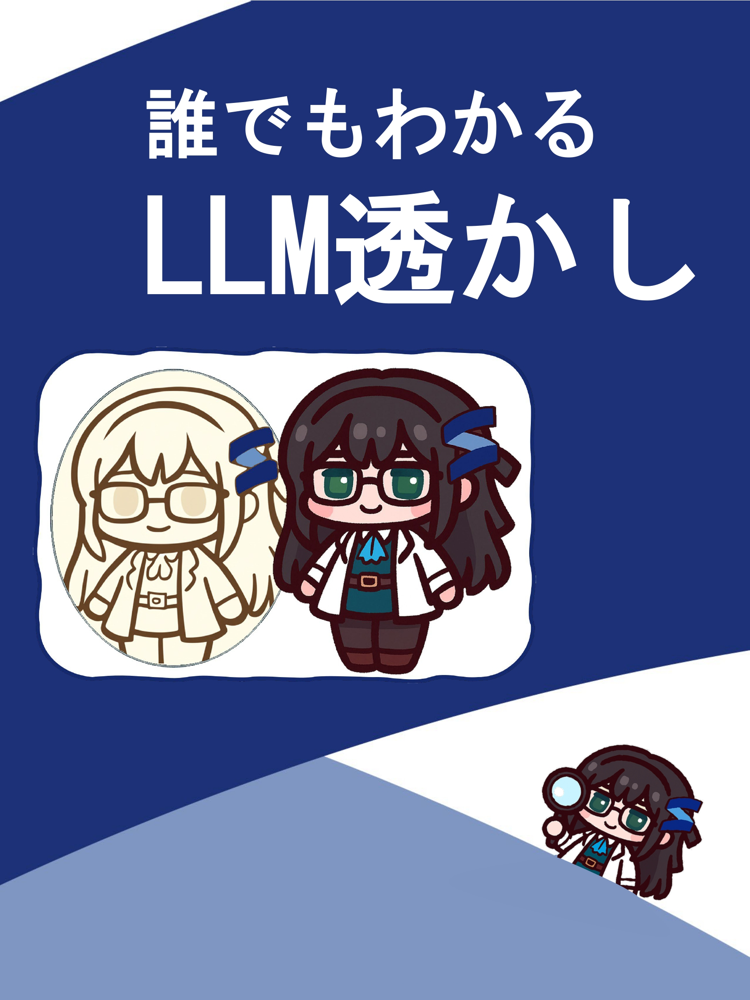
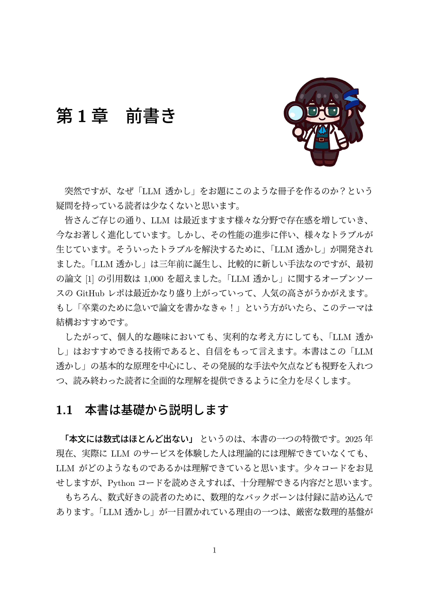
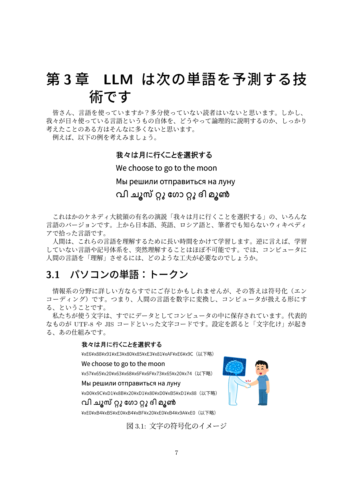
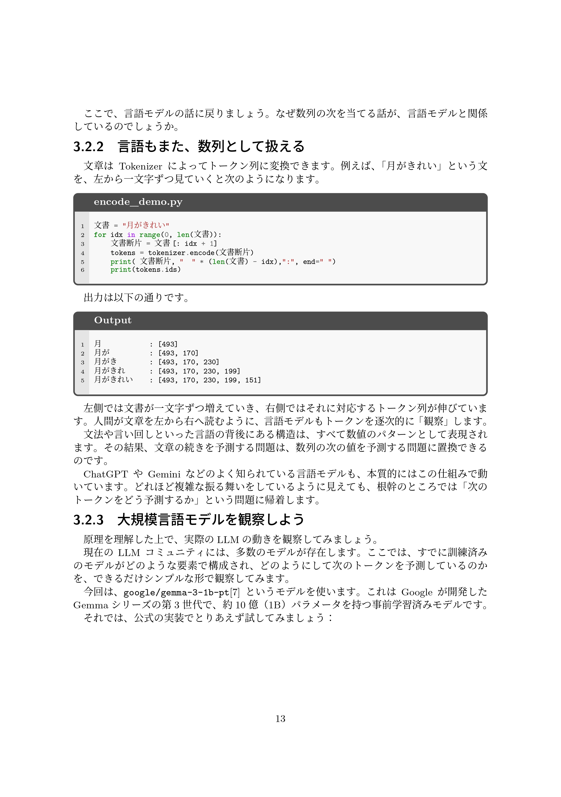

<!-- [![Contributors][contributors-shield]][contributors-url] -->
[![Forks][forks-shield]][forks-url]
[![Stargazers][stars-shield]][stars-url]
[![Issues][issues-shield]][issues-url]
[![project_license][license-shield]][license-url]

<!-- PROJECT LOGO -->
 

    

<h3 align="center">誰でも理解できる、LLM透かし</h3>
  

    <!--  
    <a href="https://github.com/XHLin-gamer/Easy_LLM_Watermark"><strong>Explore the docs »</strong></a>
     
     
    <a href="https://github.com/XHLin-gamer/Easy_LLM_Watermark">View Demo</a>
    &middot;
    <a href="https://github.com/XHLin-gamer/Easy_LLM_Watermark/issues/new?labels=bug&template=bug-report---.md">Report Bug</a>
    &middot;
    <a href="https://github.com/XHLin-gamer/Easy_LLM_Watermark/issues/new?labels=enhancement&template=feature-request---.md">Request Feature</a> -->
  

## コミケ107＠二日目 南 h-36 b

<!-- [![Product Name Screen Shot][product-screenshot]](https://example.com) -->

こんにちは、このレポはコミケ１０７に出す予定の作品「誰でも理解できる、大規模言語モデルのための電子透かし」の公式レポで、使われたコードや大体の内容はここに乗せます。大規模言語モデル（LLM）の基礎から、初心者でも理解できるように、電子透かしというLLMの出力の中に隠されたパターンを入れる仕組みを説明するつもりです。どうぞよろしくお願いします。

  
  
  
  

## あらすじ

1. [前書き](src/1.preface.md)
2. [なぜLLMの文書を追跡する技術が必要とされるか？](src/2.Motivation.md)
3. [LLM は次の単語（トークン）を予測する技術です](src/3.Proposition.md)
   1. [パソコンの単語：トークン](src/3.Proposition.md#パソコンの単語トークン)
   2. [大規模言語モデル](src/3.Proposition.md#大規模言語モデル)
4. [電子透かしとは？](src/4.LLM_Watermark.md)
   1. [偏りのある単語帳](src/4.LLM_Watermark.md#偏りのある単語帳)
   2. [モデルも迷う](src/4.LLM_Watermark.md#モデルも迷うときエントロピーの活用)
   3. [透かしの偏差値](src/4.LLM_Watermark.md#透かしの偏差値)
5. [応用](src/5.Application.md)
   1. [動的ハッシュ](src/5.Application.md#動的ハッシュ)
   2. [透かしの放射性](src/5.Application.md#透かしの放射性)
6.  [APPENDIX](src/Appendix.md)

<!-- ABOUT THE PROJECT -->

<!-- 
(<a href="#readme-top">back to top</a>)
 -->

### Built With
 [![Python][Python.org]][Python.org]  

<!-- CONTACT -->
## Contact

リン - [@X(twitter)](https://x.com/Rinn_NoPaper) - xhaughearl2@gmail.com

Project Link: [https://github.com/XHLin-gamer/Easy_LLM_Watermark](https://github.com/XHLin-gamer/Easy_LLM_Watermark)

  
進捗

| タイトル                                      | 下書き | 校正 | 備考 |
|-----------------------------------------------|--------|------|------|
|前書き                                         | 〇        | 〇 |　Thx [@TomoyasuOkada](https://github.com/TomoyasuOkada)　　|
| なぜLLMの文書を追跡する技術が必要とされるか？    |    〇    |   〇    |      |
| LLM は次の単語（トークン）を予測する技術です     |    〇     |  〇     |      |
| パソコンの単語：トークン                      |    〇     |     〇 |      |
| 大規模言語モデル                              |   〇     |      〇|      |
| 次の単語へ                                    |   〇     |      〇|      |
| 大規模言語モデルを観察しよう                  |      〇   |     〇 |      |
| LLMの内部に何が起こっているか                 |    〇     |     〇 |      |
| 多岐にわたるサンプリング手法                  |    〇     |     〇 |      |
| LLMの機能を拡張せよ                           |    〇    |      〇|      |
| 電子透かしとは？                              |    〇    |      〇|      |
| 偏りのある単語帳                              |    〇    |      〇|   Thx [@214Polaris](https://www.214polaris.top/)　   |
| 検出機構                                      |     〇   |      〇|      |
| 応用                                          |           |     〇 |      |
| 動的ハッシュ                                  |      〇   |     〇 |      |
| 透かしの放射性                                |     〇    |     〇 |      |
| LLM透かしの欠点                               |        〇    |   〇   |      |
| 結論                                          |       〇     |   〇   |      |

〇：完成

▲：進行中

ACKNOWLEDGMENTS
## 謝辞

* [Junwei Chen](https://www.214polaris.top/)
* [Keito Tada](https://github.com/keito0tada)
* [Tomoyasu Okada](https://github.com/TomoyasuOkada)
* [Wenbo Huang](https://github.com/wenbohuang1002)

(<a href="#readme-top">back to top</a>)

<!-- MARKDOWN LINKS & IMAGES -->
<!-- https://www.markdownguide.org/basic-syntax/#reference-style-links -->
[contributors-shield]: https://img.shields.io/github/contributors/XHLin-gamer/Easy_LLM_Watermark.svg?style=for-the-badge
[contributors-url]: https://github.com/XHLin-gamer/Easy_LLM_Watermark/graphs/contributors
[forks-shield]: https://img.shields.io/github/forks/XHLin-gamer/Easy_LLM_Watermark.svg?style=for-the-badge
[forks-url]: https://github.com/XHLin-gamer/Easy_LLM_Watermark/network/members
[stars-shield]: https://img.shields.io/github/stars/XHLin-gamer/Easy_LLM_Watermark.svg?style=for-the-badge
[stars-url]: https://github.com/XHLin-gamer/Easy_LLM_Watermark/stargazers
[issues-shield]: https://img.shields.io/github/issues/XHLin-gamer/Easy_LLM_Watermark.svg?style=for-the-badge
[issues-url]: https://github.com/XHLin-gamer/Easy_LLM_Watermark/issues
[license-shield]: https://img.shields.io/github/license/XHLin-gamer/Easy_LLM_Watermark.svg?style=for-the-badge
[license-url]: https://github.com/XHLin-gamer/Easy_LLM_Watermark/blob/master/LICENSE.txt
[linkedin-shield]: https://img.shields.io/badge/-LinkedIn-black.svg?style=for-the-badge&logo=linkedin&colorB=555
[linkedin-url]: https://linkedin.com/in/linkedin_username

[product-screenshot]: images/screenshot.png
[Python.org]: https://img.shields.io/badge/python-3670A0?style=for-the-badge&logo=python&logoColor=ffdd54
[astral.sh]: https://img.shields.io/badge/uv-package%20manager-blueviolet?style=for-the-badge&logoColor=white

<!-- -->