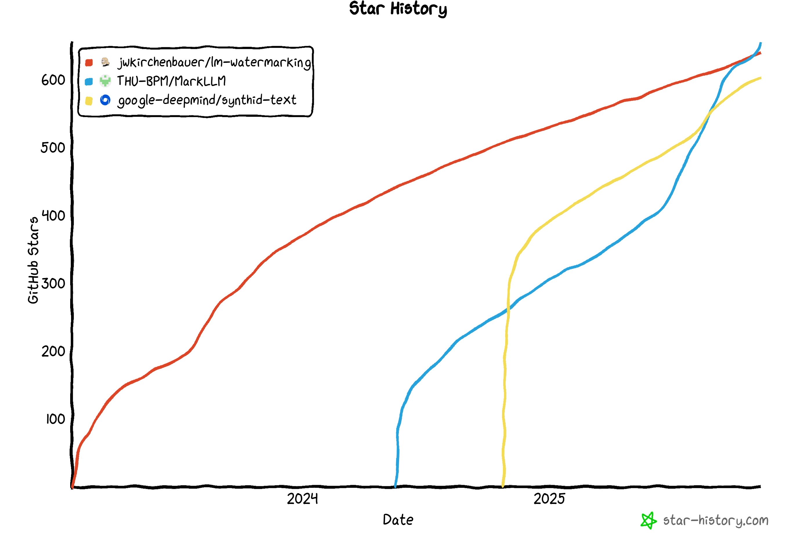

# 前書き

突然ですが、なぜ「LLM透かし」をお題にこのような冊子を作るのか？
という疑問を持っている読者は少なくないと思います。
皆さんご存じの通り、LLMは最近ますます様々な分野で存在感を増していき、今なお著しく進化しています。
しかし、その性能の進歩に伴い、様々なトラブルが生じています。そういったトラブルを解決するために、「LLM透かし」が開発されました。
<!-- ↑ここで、今日なぜLLM透かしを紹介したい理由をはっきりにします -->

<!--「LLM透かし」はそのようなトラブルを解決できる素晴らしい技術であるから、今皆さんが手にした薄い本を作っただけとは、残念ながら、作者はそんなに立派な人間ではありません。-->

「LLM透かし」は三年前に誕生し、比較的に新しい手法なのですが、最初の論文[1]の引用数は1,000を超えました。「LLM透かし」に関するオープンソースのGitHubレポ最近かなり盛り上がっていって、人気の高さがうかがえます。もし「卒業のために急ぎ論文を書かなきゃ！」という方がいたら、このテーマは結構おすすめです
<!--だから、このような人気のあるトピックについて研究するのは、コスパが良いし、無事に修士を卒業する確率もぐっと上がるというわけです。（修士号を取得するために、国際学会の論文ノルマがある研究室も存在しています）-->

したがって、個人的な趣味においても、実利的な考え方にしても、「LLM透かし」はおすすめできる技術であると、自信をもって言えます。本書はこの「LLM透かし」の基本的な原理を中心にし、その発展的な手法や欠点なども視野を入れつつ、読み終わった読者に全面的な理解を提供できるように全力を尽くします。

<!-- 本書は基礎から説明する -->

**「本文には数式はほとんど出ない」** というのは、本書の一つの特徴です。２０２５年現在、実際にLLMのサービスを体験した人は、数式無しでもLLMに対する理解は、ある程度はできていると思います。少々コードをお見せしますが、Pythonコードを読めさえすれば、十分理解できる内容だと思います。

もちろん、数式好きの読者のために、数理的なバックボーンは付録に詰め込んであります。「LLM透かし」が一目置かれている理由の一つは、この厳密な数理的基盤があるからです。とはいえ、そこ抜きでも肝心の概念は理解できるので、本文ではあえて割愛します。
<!--しかし、数式がないというのは、決して「LLM透かし」は数理的に信頼できる手法ではないじゃなく、むしろそこらへんに転がっていたLLM検出サービスより、理論的な信頼性が高いはずです。-->
<!-- こういった固い内容は、付録にまとめてありますので、興味のある方はぜひ目を通してみてください。 -->

本書の構成について、次の第二章では、LLMが生成する文章を追跡する理由を説明します。そもそもこういう技術はなぜ必要とされているのかについてお話します。第三章では、LLMの基礎原理を軽く復習します。LLMの原理はLLM透かしにとっては極めて重要なものになります。第四章では、電子透かしの仕組みを紹介します。第五章では、その応用や面白い性質について、軽く触れます。また、筆者自身が発表した論文の内容も軽く触れたいと思っています。「LLM透かし」は良い面だけではなく、欠点も存在します。その欠点について、第六章でご紹介します。

前書きなのに、長々と書いてしまい申し訳ございません。本書の内容及びコードはすべてGitHubで公開しています。リンクはこちらです：https://github.com/XHLin-gamer/Easy_LLM_Watermark

それでは、これから最近結構問題になった訴訟からお話ししましょう。

[1] Kirchenbauer, John, et al. "A watermark for large language models." International Conference on Machine Learning. PMLR, 2023.

