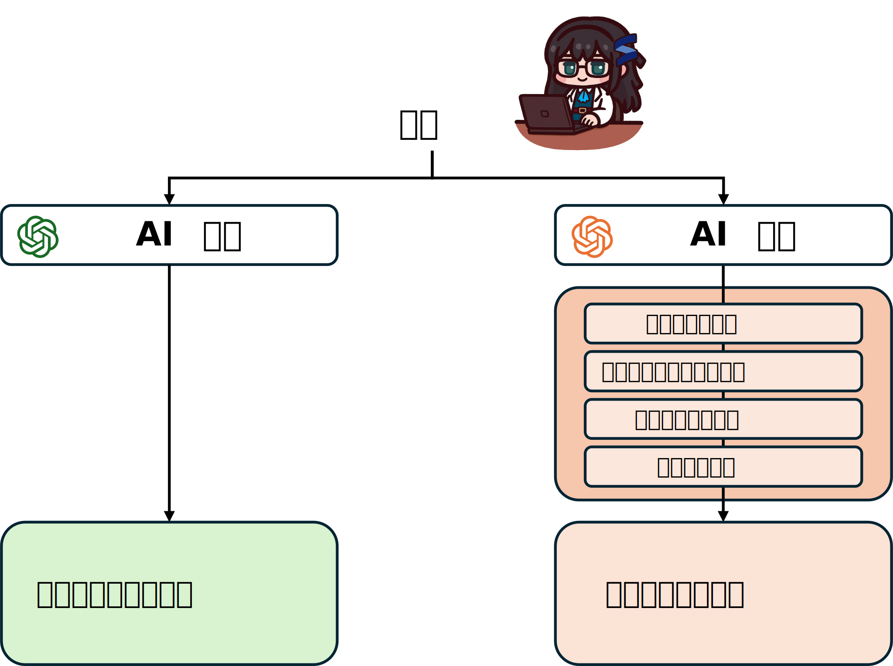

# なぜLLMの文書を追跡する技術が必要とされるか？

2025年8月26日、日経新聞および朝日新聞がアメリカのパープレキシティ（Perplexity AI, Inc.）を提訴しました。日経・朝日側の論点は著作権侵害でした。実はこれは最初のAIサービスの中に著作権にめぐる論争ではなく、２０２５年半ばまでには、アメリカではすでに二十件以上の訴訟が記録されていました。

それでは、なぜ新聞社とAIの間でこのような論争が繰り広げられるのでしょうか？ その原因はシンプルで、新聞記事のデータが高品質なAIサービスを作るために適しているからです。

例えば、上の図のように、ユーザーが同じ質問を二つのAIに投げるとします。AI太郎は学習した知識だけで単なる答えを生成するのに対して、AI次郎はまずその問題をGoogle等で検索し、さらに自社で集めたデータベースと照合し、最終的には人間の専門家にチェックを依頼した後に答えを出します。

普通に考えたら、AI次郎の答えの方が、AI太郎のそれより優れているに違いありません。しかし、グーグルはともかく、質問ごとに「人間の専門家を雇ってチェックを入れる」というのは現実的ではありません。そこで現在、現実的に最も採用されている手法は、より多くの信頼できるデータを自社のデータベースに詰め込み、参照させることです。すなわち、生成される文章の信頼性を、信頼できるデータで担保するというやり方です（RAGなど）。

ここで、先ほどの日経新聞の話に繋がります。新聞というのは、新聞者が入念にファクトチェックをした高い信頼性をもつデータです。それを参照用データベースにとってはもってこいなのですが、何せ著作権のあるもので、安易に使うのはできません。

かといって、もしAI企業がその記事を本当にどこかで取り入れた場合、AI企業側が意図的に盗用したとは限りません。データベースの中身が膨大過ぎて、開発者すらすべてのデータを把握することは難しいでしょう。さらに、現代のLLMを訓練するために、安直にして、自社のデータベースだけを使うのはできません。往々にして、とりあえずインターネット上のありとあらゆるデータを一通り学習し（事前学習）、LLMの中に言語の基礎知識をある程度蓄積しさせます。そこから、高い質の自社データベースを投入し、色々の機能を付け加えます。新聞記事もネット上のデータの一つですから、あえてその新聞社のサイトを避けて学習させたとしても、転載された記事などが別の経路でLLMに拾われる可能性もあります。

結論として、現代のLLMの訓練に大量のデータは必要です。しかし、そのデータの中に「著作権で保護されたデータ」が混入しているかどうかを判断する手法は、いまだ確立されておりません。

さらに、LLMのデータを追跡・判断するのは、データを持っている権利者だけでなく、LLMの開発元、例えばOpenAIやGoogleなどのIT会社にも、切羽詰まっている課題になりつつあります。先ほど説明した通り、AIを作るために、膨大な高品質のデータが必要とされています。しかし、生成AIがこれまで普及したら、それにより生成した文章も世にはびこるわけです。そこで、もしAI学習に、他のAIが生成したデータを取り入れたらどうなるか、説明するまでもなく、極めて悪い影響が与えます[2,3]。これは「ウロボロス現象」や「モデルの崩壊（Model Collapse）」[6]とも呼ばれる事象です。「ウロボロス現象」が発生したら、ホムンクルスになって錬金術師とバトルするーーわけでなく、モデルの性能が著しく低下する傾向が見られます。それを防ぐために、自分のAIの生成した内容を追跡し、それをもう一度に自分の訓練用のデータセットに入らないようにするのは重要であることが言うまでもなく、それをある程度実現した手法[7]は２０２５年の雑誌Natureにも掲載されました。

ここまで説明した内容は、パンピーにはあまり関係がないように思えるかもしれません。
しかし、AIの追跡は普通のユーザーにとっても極めて重要な話題です。
最近AIを使ってカンニングする学生がよく新聞で出て来るではないか。
それと伴い、宿題などの中に、AIが生成した部分があるかどうかを判定するサービスも近年増えてきました。

しかし、それの信頼性はまだ未知数です。
第一、AIの文章を判定する手法はいくつかありますが、何をもって「最善」とするかの定説はまだありません。
その中の最重要課題として、「人間が書いたものを、誤ってAIだと判定しない（冤罪を防ぐ）」。
一度でも、冤罪をかぶせしまえば、サービスへの信頼が根本的に崩れ去るからです。
近い未来、皆さん多分こういうAI検出サービスに出くわすかもしれないし、学生の方は多分すでに経験済みだと思います。
「どうやって適切に判定し、かつ誤検出を極力防ぐか」は、皆さんの卒業（最近は卒論のAI判定を行う学校もあります）や、これからのAI活用において、死活問題になり得るのです。

それでは、話を進めます。なぜ別の技術ではなく、LLM透かしに注力するのか？それは、既存の検出技術の根本的な部分に、先ほど述べた「誤った判断を絶対にしない」という目標と相反する要素を感じているからです。

極めて大まかに説明すると、今よく使われている代表的な手法は主に二種類あります。検出専用のモデル（分類器）」を作る[4]と、「LLMそのものを使い」、与えられた文章がAI製かどうかを判断させます[5]。

前者は、大量の「LLMが生成したデータ」と「人間が書いたデータ」を集め、その上で、LLM特有の特徴（人間にはない癖など）を探し出し、それを根拠に両者を見分けます。もちろん、機械学習による分類モデルなどがこれに当たります[5]。しかしこのような手法は、予め集められたデータに多い依存しているという重大な欠点であります。何よりLLMの進歩がすさまじく、今日見つかったLLMの文書の特徴が、明日に無効化されるかもしれません。

そこで提案されたのがもう一つの手法です。。ざっくり言えば、「LLMの能力がそこまで高いなら、LLMそのものを使ってLLM製の文書を判断させることも可能なはずだ」というアプローチです。例えば、LLMにそのまま判断すべき文書を投げて、「これは人間が書いたかどうか」を直球で聞いてみます。もっと巧みな手法として、筆者と同じ大学の研究者によるOUTFOX[5]というものがあります。これは、LLMに「人間が書いた文書」と「LLMが書いた文書」を参考として見せ、その上で「所属不明の文書」を与え、どちらのグループに入るかをLLMに推論させるというものです。
OUTFOXは加担なきでも、非常に創造的な手法だと言い切れます。

しかし、「LLMが書いた文書かどうかの判断を、LLMそのものに任せる」という点には疑問が残ります。論理的に言えば、これはタコ足配線（あるいは循環論法）のような危うさがあります。LLM文書判定の信頼性を、理論的な信頼性がまだ完全に証明されていない「LLMそのものの推論能力」に託しているからです。

こういった諸々の問題を解決したく、LLM電子透かしがいよいよ登場します。しかし、次の一節に足を踏み入れる前に、これまでに話したことを少々まとまります。

------

**近年LLMが社会にあまたなインパクトを与えていて、その生成物を追跡・判定する技術の重要性が日に日に増しています。この技術は、新聞社などの権利者だけでなく、ＡＩの開発者、そして一人ひとり個人ユーザーにおいても重要な意味を持ちます。いくつかの検出技術が提案されていますが、信頼性の面でまだ課題が残っています。そこで、信頼性の高い「LLM透かし」が脚光を浴びているのです。**

-----

[1]https://www.nikkei.com/article/DGXZQOUD224SD0S5A720C2000000/

[2]Alemohammad, Sina, et al. "Self-consuming generative models go mad." The Twelfth International Conference on Learning Representations. 2023.

[3]Shumailov, Ilia, et al. "The curse of recursion: Training on generated data makes models forget." arXiv preprint arXiv:2305.17493 (2023).

[4]Guo, Biyang, et al. "How close is chatgpt to human experts? comparison corpus, evaluation, and detection." arXiv preprint arXiv:2301.07597 (2023).

[5]Koike, Ryuto, Masahiro Kaneko, and Naoaki Okazaki. "Outfox: Llm-generated essay detection through in-context learning with adversarially generated examples." Proceedings of the AAAI Conference on Artificial Intelligence. Vol. 38. No. 19. 2024.

[6]Shumailov I, Shumaylov Z, Zhao Y, Papernot N, Anderson R, Gal Y. AI models collapse when trained on recursively generated data. Nature. 2024 Jul;631(8022):755-759. doi: 10.1038/s41586-024-07566-y. Epub 2024 Jul 24. Erratum in: Nature. 2025 Apr;640(8058):E6. doi: 10.1038/s41586-025-08905-3. PMID: 39048682; PMCID: PMC11269175.

[7] S. Dathathri, A. See, S. Ghaisas, P.-S. Huang, R. McAdam, J. Welbl, V. Bachani, A. Kaskasoli, R. Stanforth, T. Matejovicova, J. Hayes, and N. Vyas, “Scalable watermarking for identifying large language model outputs,” Nature, vol. 634, no. 8035, pp. 818–823, 2024.