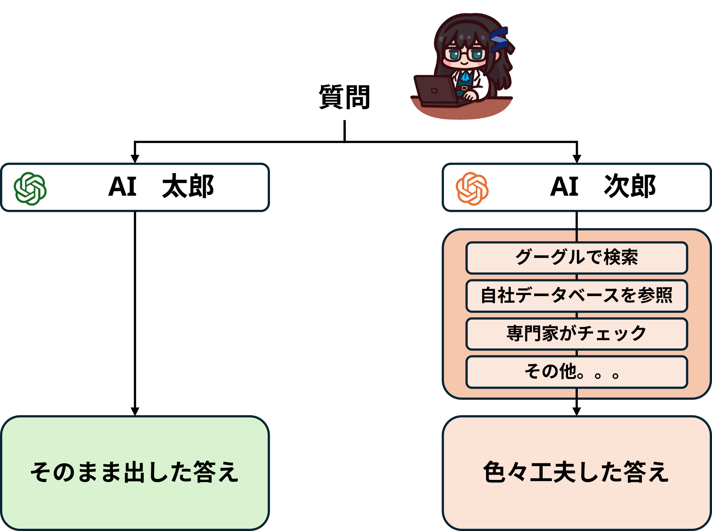

# なぜLLMの文書を追跡する技術が必要とされるか？

## 著作権をめぐる、AI時代の対立(僕らの著作権が何者かに侵略されているぞ♪)

2025年8月26日、日本経済新聞社および朝日新聞社は、米国のAI企業パープレキシティ（Perplexity AI, Inc.）を著作権侵害の疑いで提訴しました。
この訴訟は、日本の主要メディアがAIサービスを直接訴えた初めての事例として注目を集めています。

もっとも、AIと著作権をめぐる論争は、これが初めてではありません。2025年半ばまでに、米国ではすでに20件以上の生成AI関連の著作権訴訟が提起されています。
このように、生成AIと既存コンテンツの関係は、いまや法的にも社会的にも無視できない段階に入っています。

では、なぜ新聞社とAI企業の間で、これほどの対立が生じるのでしょうか。
その背景には、「**高品質なAIサービスにおいて、新聞記事が価値の高いデータ**」であるという事実があります。

### 「信頼できるデータ」は、著作権がつきものです
例えば、下の図のように、同じ質問を二つのAIに与えた場合を考えてみましょう。どっちの回答が質が高いですか？
- **AI太郎**は、学習で得た知識のみをもとに回答を生成します
- **AI次郎**は、まず検索エンジンを用いて情報を収集し、自社のデータベースと照合したうえで、最終的には専門家による検証を経て回答を提示します。

直感的にも、後者のAI次郎のほうが、より正確で信頼性の高い回答を返すと考えられます。
しかし、現実には「質問ごとに人間の専門家がチェックする」という運用は、コストやスケールの面で成立しません。

そこで現在、広く採用されているのは、「信頼できるデータを自社のデータベースに詰め込み、生成時に参照させる」手法です。
すなわち、生成される文章の信頼性を、参照元データの信頼性によって担保する考え方です（RAGなど）。

ここで、先ほどの新聞社の訴訟に繋がります。
新聞は、専門の記者と編集者による入念な取材とファクトチェックを経た、高い信頼性をもつデータです。
そのため、参照用データベースにとってはもってこいなのです。
しかし同時に、新聞記事は著作権で保護されており、無断で利用することはできません。

#### 「使わなければよい」では済まされない理由

「それでは、新聞のようなデータを取り除けば、著作権の侵害が防げるのでは？」とお考えをしている読者はいるでしょうか？
もちろん、これは一番直球的な手法です。

しかし、ここでの問題は、「**AI企業が意図的に盗用しようとしなくても、学習や運用の過程で結果的にどこかで取り入れてしまう可能性がある**」、という点です。

現代のLLMを作るには、まずインターネット上のありとあらゆるデータを一通り学習し（事前学習）、言語の基礎知識をある程度蓄積させます。
その後、高い質の自社データベースを投入し、様々な機能を付け加えます（追加学習、ファインチューニング）。
新聞記事もインターネット上のデータの一部である以上、たとえ公式サイトを避けたとしても、転載記事や引用を通じて、別の経路から学習データに含まれてしまう可能性は否定できません。

要するに、大量のデータが必要とする一方で、「訓練データの中に著作権で保護されたコンテンツが含まれているか」を確実に判別する手法は、いまだ確立されていません。
この問題は、著作権の権利者だけでなく、AI開発者にとっても深刻です。「意図せず不適切なデータが混入しないようにしたい」という需要は、両者に共通しています。

## 思わぬ共通点：モデルの崩壊

LLMの開発元、例えばOpenAIやGoogleなどのIT会社も、「AIの追跡」という問題に切羽詰まっているのが現状です。
生成AIが社会に広く普及すれば、インターネット上にはAIが生成した文章が急増します。
もし、AIが生成したデータを、別のAIの学習に用いてしまったらどうなるでしょうか？

このような再帰的な学習は、「ウロボロス現象」や「モデルの崩壊（Model Collapse）」と呼ばれています[2,3,6]。
名前は○○の錬金術師を想起させるが、実際にはモデルの性能を著しく劣化させることが知られております。

この現象を防ぐためには、自分たちのAIが生成した文章を識別・追跡し、それが再び学習データに紛れ込むしないように管理することが不可欠です。
実際、そのような追跡を可能にする技術はすでに提案されており、2025年には関連研究がNature誌にも掲載されています[7]。
今「SynthID」で検索したら、グーグル社のサービスが出てくるはずです。
それはまさに、グーグル自信が開発したAIの出力を、また訓練用データに戻さないためのサービスです。

## 一般ユーザーにとっても無関係ではない
ここまで説明した内容は、一般のユーザーにはあまり関係がないように思えるかもしれません。
しかし、AIの追跡は普通のユーザーにとっても極めて重要な話題です。

最近、AIを使ってカンニングする学生が増えています。
それに伴い、課題などの中にAIが生成した部分があるかどうかを判定するサービスも増えてきました。

しかし、それらの信頼性はまだ未知数です。
そもそも、AIの文章を判定する手法はいくつかありますが、何をもって「AI」と認定するかの定説はまだありません。

また、とりわけ重要なこととして、「人間が書いたものを、誤ってAIだと判定しない（冤罪を防ぐ）」ということです。
一度でも、冤罪をかけてしまえば、サービスへの信頼が根本的に崩れ去るからです。

近い未来、皆さん多分こういうAI検出サービスに出くわすかもしれませんし、学生の方は多分すでに経験済みだと思います。
「どうやって適切に判定し、かつ誤検出を極力防ぐか」は、皆さんの卒業（最近は卒論のAI判定を行う学校もあります）や、これからのAI活用において、死活問題になり得るのです。

## これらの問題を解決ためのLLM透かし

では、なぜ数ある手法の中で、LLM電子透かしに注目するのでしょうか。
それは、既存の検出技術の多くが、「誤判定を極力避ける」という要求と根本的に相反する弱点を抱えているからです。

現在主流の手法は、大きく二つに分けられます：

1つ目は、検出専用の分類モデルを用いる方法です[4]。

大量の「AIが生成した文章」と「人間が書いた文章」を集め、両者の比較により、統計的な違いや癖を学習させて判別します。
この方法は、過去に収集したデータに強く依存するという致命的な欠点があります。
LLMの進化は非常に速く、今日有効だった違いが、明日には通用しなくなる可能性が否定できません。

2つ目は、LLMそのものに判定を任せる方法です[5]。

例えば、対象となる文章をLLMに与え、「これは人間が書いたものか」と直球で問いかけます。
さらに洗練された手法として、筆者と同じ大学の研究者が提案したOUTFOX[5]があります。
これは、人間文書とLLM文書の例を提示したうえで、所属不明の文章をどちらに近いか推論させる手法です。
非常に創造的で興味深いアプローチと言えるでしょう。

しかし、「LLMが書いたかどうかを、LLM自身に判断させる」という構造には、理論的な不安が残ります。LLM文書判定の信頼性を、理論的な信頼性がまだ完全に証明されていない「LLMそのものの推論能力」に託しているからです。

こういった諸々の問題を解決するために、LLM電子透かしがいよいよ登場します。次の一節に足を踏み入れる前に、これまでに話したことを少々振り返ります。

## いざ、LLM透かしへ

以上の問題意識を踏まえて登場するのが、LLM電子透かしです。
生成の段階で、あらかじめ検出可能な信号を埋め込むことで、高い信頼性で判定することを可能になります。

------

**近年LLMが社会に様々なインパクトを与えていて、その生成物を追跡・判定する技術の重要性が日々増しています。
この技術は、新聞社などの権利者だけでなく、AIの開発者、そして一人ひとり個人ユーザーにおいても非常に重要な意味を持ちます。
既存の検出技術には信頼性の面で限界があり、その解決策として、信頼性の高い「LLM透かし」が脚光を浴びています。**

-----

それでは、LLM透かしの説明に入る前に、まず必要となる基礎知識を整理しておきます。
もっとも、すでにこの分野に詳しい読者の方もいらっしゃるでしょう。
その場合は、第三章を読み飛ばして第四章へ進んでいただいて構いません。

-> 第三章へ

-> 第四章へ　

-----

[1]https://www.nikkei.com/article/DGXZQOUD224SD0S5A720C2000000/

[2]Alemohammad, Sina, et al. "Self-consuming generative models go mad." The Twelfth International Conference on Learning Representations. 2023.

[3]Shumailov, Ilia, et al. "The curse of recursion: Training on generated data makes models forget." arXiv preprint arXiv:2305.17493 (2023).

[4]Guo, Biyang, et al. "How close is chatgpt to human experts? comparison corpus, evaluation, and detection." arXiv preprint arXiv:2301.07597 (2023).

[5]Koike, Ryuto, Masahiro Kaneko, and Naoaki Okazaki. "Outfox: Llm-generated essay detection through in-context learning with adversarially generated examples." Proceedings of the AAAI Conference on Artificial Intelligence. Vol. 38. No. 19. 2024.

[6]Shumailov I, Shumaylov Z, Zhao Y, Papernot N, Anderson R, Gal Y. AI models collapse when trained on recursively generated data. Nature. 2024 Jul;631(8022):755-759. doi: 10.1038/s41586-024-07566-y. Epub 2024 Jul 24. Erratum in: Nature. 2025 Apr;640(8058):E6. doi: 10.1038/s41586-025-08905-3. PMID: 39048682; PMCID: PMC11269175.

[7] S. Dathathri, A. See, S. Ghaisas, P.-S. Huang, R. McAdam, J. Welbl, V. Bachani, A. Kaskasoli, R. Stanforth, T. Matejovicova, J. Hayes, and N. Vyas, “Scalable watermarking for identifying large language model outputs,” Nature, vol. 634, no. 8035, pp. 818–823, 2024.