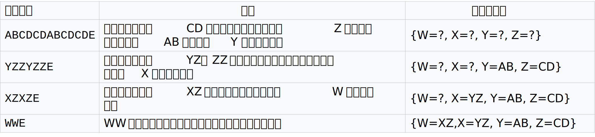
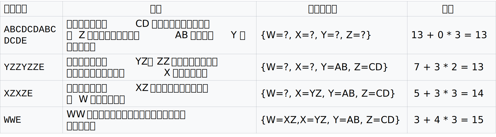
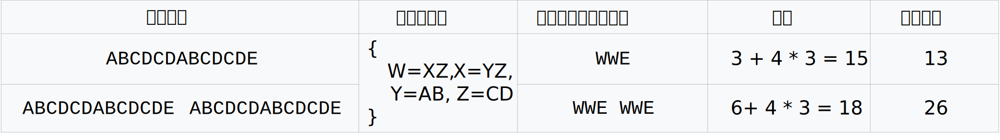
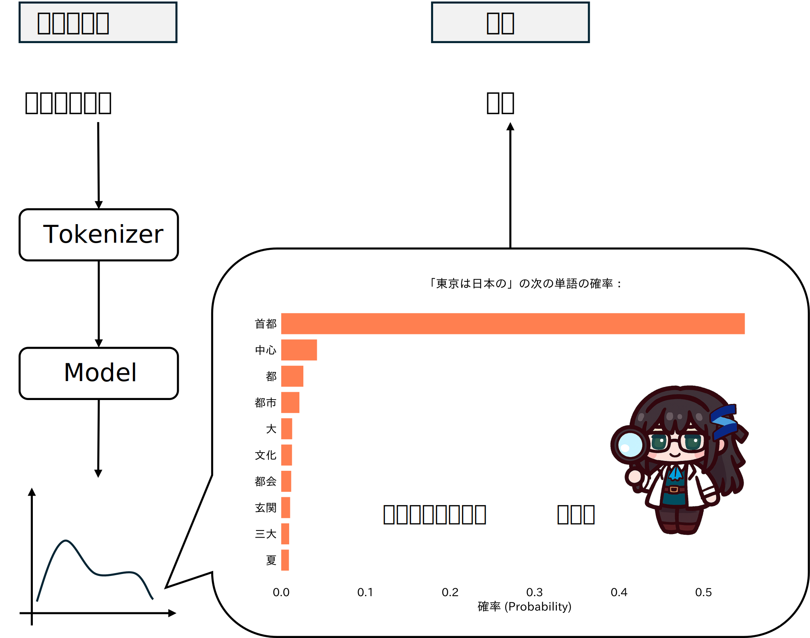
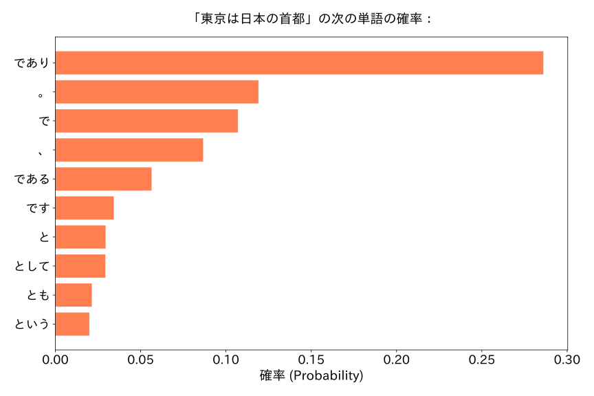
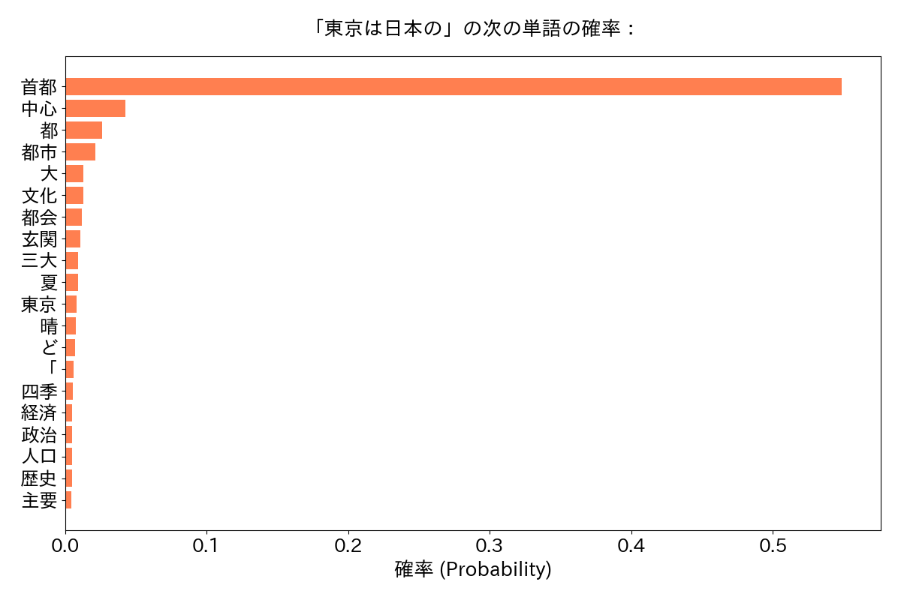
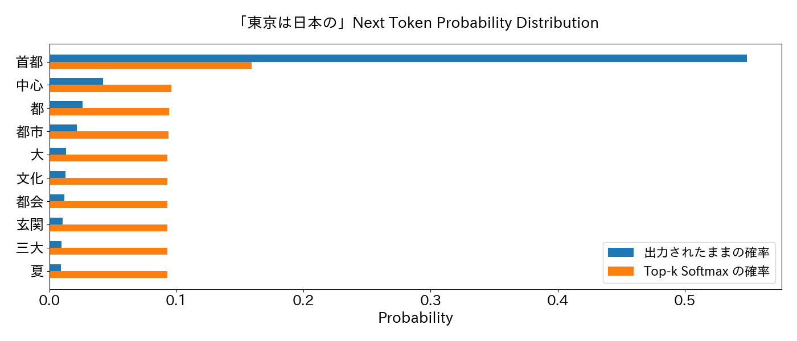
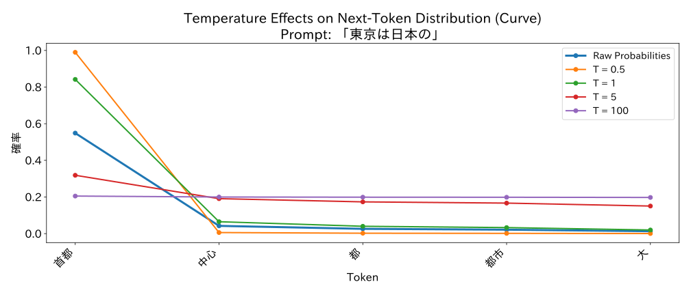

# LLM は次の単語（トークン）を予測する技術です

皆さん、言語を使っていますか？多分使っていない読者はいないだと思います。しかし、我々が日々使っている言語というのは、どうやって論理的に説明するのか、しっかり考えたことのある方がそんなに多くないだどう。例えば、以下のもののすべてが言語の事象になります：

---
我々は月に行くことを選択する

Why we choose to go to the moon

Мы решили отправиться на луну

വി ചൂസ് റ്റു ഗോ റ്റു ദി മൂൺ

---

これはかのケネディ大統領の有名の演説「我々は月に行くことを選択する」の、いろんな言語のバージョンです。上から日本語、英語、ロシア語と筆者でも知らない、ウィキペディアで適当に拾った見たことのない言語です。このように、人間にとっては、言語を理解するために、長い時間をかけて学習する必要性があり、学習したことのない符号や言語などを理解するのは到底できないです。それでは、パソコンに人間の言語を学習させるためには、どのような技術が必要としているでしょう。

## パソコンの単語：トークン

情報学科に詳しい方はすでに分かっているかもしれないが、答えはデータ化です、数字とも言えます。以上お見せ示した言語のすべてが、データとして、パソコンに保存しております。有名なのは、UTF８やJISコードなどのプロトコルで、誤ったら、文字化けが出で来るやつです。


＃　修正↑

上の図に示したのは、人間の言語をデータ（数字）になるとどうなるのかの一例です[1]。採用された文字コードがJIS、よくなじむ日本産業規格（JIS）に収録されているものです。日本産業規格にしても、別に日本語しか対応できないわけではなく、いろんな言語が対応できるということがはっきりわかります。其の上、言語の符号、それは漢字でもアルファベットでもよく知らない文字でも、全部数字に変換することが可能です。皆さん毎日使っているスマホやパソコンの中に、実際人間の言語ではなく、こういった数字で動かしているということは明白です。こういった文字コードはまさに、パソコンの言語で、数字一個一個がパソコンの単語のようなものに等しいでしょう。

それでは、このJIS標準を使って、そのままAIの訓練に用いられることは可能でしょうか？残念ながら、それはできません。まったくできないというわけではないが、著しく欠点が存在しております。それは、単語の量が多すぎるということです。例えば、実際の開発でよくつかわれるUnicodeで、収録可能の符号位置は111万4,112個あって、現在使われていた数だけでも１６万弱に達しています[3, 4]。もしこの符号がパソコン言語の単語で例えるなら、１６万の単語を保有する言語になります。もちろん、単語の数が小さいほど、言語が学習しやすいのは言うまでもなく、Unicodeのような文字コードをそのまま使うと、学習する難易度が結構高まることが予想されるでしょう。

それではどうするのだ、情報量を保持しつつ、単語の数を減らす方法は存在しますか？というと、存在しています。それは、バイト対符号化（ＢＰＥ）[2]のような、テキスト圧縮アルゴリズムです。皆さんがフォルダをＺＩＰファイルにするときに、別に記録されていました情報量が変更したわけではなく（元に戻せる）、しかし、ディスク容量は確実に節約することができます。ＢＰＥの名前は一見難しいそうですが、ふたを開けたら、そんなに難しいことをやっていない。ウィキペディアの例[5]を引用し、説明すると


操作ごとに説明すると、一行目に、元の文は ```ABCDCDABCDCDE``` になります、総計アルファベット１３個があります。その中に、```AB``` のような対（ペア）が二回、```CD```のような対が四回現れました。こういった出現頻度が２以上の対を、新たな符号を与えます。例えば、```AB```を```Y```にし、元の文の中の```AB```の部分を全部```Y```に書き換えることにより、元の部分的な長さは二分の一にできます（もう一つの例として、もしある文```ABABAB```が存在して、```Y```を代入すると、```YYY```になるはずです。これで一気に半分くらい短縮することができました）。```{Y = AB, Z = CD}```を第一行目のテキストに代入すると、二行目のテキストが出できました。ここでさっきと同じ操作を行います、すなわちよく出で来る対を探します。第二行目では、よく出で来る対は```YZ```ということで、新たな```X <- YZ```として辞書に追加し、第三行のテキストが出できました。最終行のテキストの中に、唯一のついは```WW```ということで、しかも出現頻度は一回しかありません。ここで、アルゴリズム終了とします。

この例は一見いい感じに説明して、まとまっているところ、違和感を覚えている方は極めて鋭いです。



１３個アルファベットのテキストを三つのアルファベットに圧縮するのはいいか、忘れちゃいけないものがあります。そう、辞書そのものの容量をかかります。もし辞書の容量も計算すると、なんと、１３個のアルファベットを圧縮するために、15個のアルファベットを消費しました。これは逆に容量を増えているではないか？でも、別にこれはBPE技術が実のところ、無効というわけではなく、あくまでも、ウィキペディアの例が誤解しやすいだけです。例えば、元のテキストが二倍長さになる場合はどうなりますか：



同じ辞書を使う場合、別に取り扱うテキストの長さが倍にしても、辞書の長さは不変であることは自明です。同時に、辞書化した後のテキストも元のテキストと同じ二倍にすることになります。しかし、辞書化した後に、二倍にした部分は極端に圧縮したことはものが語っていって、全体の容量は１８しか消費していません。この場合、26個のアルファベットを消費するはずの場合、辞書化した後18しかつかっていないという状況になりました。もし、テキストがもっと長くなると、こういった圧縮の効果がより顕著になるでしょう。

これで、一見落着になるですが、実はもう一つ問題が残っています。ウィキペディアの例の第四行目をよく見てください。辞書の中に、```W, X, Y, Z```が含まれていって、```E```がそのまままだ残っている。こういう辞書作りをするときに、漏らさないために、その辞書は理論的な最小サイズが存在しております。カッコ良く言い換えれば、「数学的な下限」が存在しております。でも、この最小サイズが実は結構小さいもので、例えば、「吾輩は猫である」の全部を符号化するために、128個の単語さえあれば十分です（別に単語の数が少ないほうがいいわけではありません、あくまでも人間の言語が案外に圧縮できるということの一例です）。それでは、もし、その辞書の中に存在していない単語が出できたら、どういうことが起こるのか。いうまでもなく、取り扱えません。エラーが出できます。これが昔の言語モデルが、絵文字などのデータを処理するときに性能が悪い一因にもなっています。

一端話をまとめると、より効率のいい文字コードを作るために、バイト対符号化（ＢＰＥ）がよくつかわれています。ＢＰＥとは、データを圧縮する技術であり、言語処理においては、数字化した人間の言語の中に、よく出で来るパターンをかき集め、パソコンの辞書を作ること。こういう人間の言語をいちいちパソコンの単語に変換するものは、みんながよく言う**Tokenizer**で、パソコンの単語の正式名称も**Token**となります。

それでは、実際にTokenizer体験してみよう。これから、少々コードが出ます、分かりやすいように書いているのは、ご心配なく。

とりあえず、Tokenizerを作るためには、元になるテキストが必要です。ここで、生み出すテキストを元に戻してみよう：

```python
from 有用なスクリプト import load_txt
for sentence in load_txt(path="./吾輩は猫であるutf8.txt")[:10]:
    if len(sentence) > 1:
        print(sentence if len(sentence) < 50 else sentence[:50]+"　（以下略）")
```
そして出力は『吾輩は猫である』の一部です
```
吾輩は猫である

夏目漱石

　吾輩《わがはい》は猫である。名前はまだ無い。

　どこで生れたかとんと見当《けんとう》がつかぬ。何でも薄暗いじめじめした所でニャーニャー泣いていた事　（以下略）
　この書生の掌の裏《うち》でしばらくはよい心持に坐っておったが、しばらくすると非常な速力で運転し始め　（以下略）
　ふと気が付いて見ると書生はいない。たくさんおった兄弟が一｜疋《ぴき》も見えぬ。肝心《かんじん》の母　（以下略）
　ようやくの思いで笹原を這い出すと向うに大きな池がある。吾輩は池の前に坐ってどうしたらよかろうと考え　（以下略）
　吾輩の主人は滅多《めった》に吾輩と顔を合せる事がない。職業は教師だそうだ。学校から帰ると終日書斎に　（以下略）
　吾輩がこの家へ住み込んだ当時は、主人以外のものにははなはだ不人望であった。どこへ行っても跳《は》ね　（以下略）
```
これはすでにGitHubで用意されているテキストファイルです。それでは、実際にTokenizerを作ってみよう。具体的な実装方法は割愛します。興味のある方は```有用なスクリプト.py```に参照してください。重要なことは、Tokenizerを訓練するために、必要な要素として、ただテキスト元とほとんど任意に指定できる辞書の大きさだけが必要なのです。
```python
from 有用なスクリプト import train_tokenizer

tokenizer = train_tokenizer(
    file_path="./吾輩は猫であるutf8.txt",   # テキスト元になるファイル
    vocab_size=5000,                       # 辞書の大きさ
    text_to_compress = "吾輩わがはいは猫である。名前はまだ無い。"
)
```
このコード出力結果として、以下のものが出で来るはずです：
```
Tokenizerの指定単語数は 5000...
訓練完了

--- テキスト容量比較 ---
比較用サンプル: '吾輩わがはいは猫である。名前はまだ無い。'

[UTF-8 容量]
  bytes: 60
  bits (bytes * 8): 480

[BPE 容量]
  辞書容量: 5000
  トークンごとのbits密度 (ceil(log2(vocab_size))): 13
  トークン数: 10
  トークン: [315, 2459, 535, 144, 4662, 142, 1873, 3784, 3646, 142]
  bits (トークン数 * bits_per_token): 130

--- 📊 最終結果 ---
UTF-8 Bits: 480
BPE Bits:   130
-> 圧縮比率: 3.69 (UTF-8 bits / BPE bits)
```
「吾輩わがはいは猫である。名前はまだ無い。」の一言を数字化するため、UTF８（Unicode）なら480 bitsを消費するに対してBPEが辞書の大きさが5000の状態で１３０　bitsしかかかりません。これは大きな圧縮です。

次に、このトークンが元のテキストに戻れるかどうかを試してみよ、人間の理解できる言語に戻せないなら、元も子もないからな：
```python
適当な文章 = "論文を書くのは辛い El Psy Congroo 🥺"
print("適当な文章:\t", 適当な文章)
トークン = tokenizer.encode(適当な文章).ids
print("トークン: \t", トークン[:15])
日本語文書 = tokenizer.decode(トークン)
print("復元した日本語:\t", 日本語文書)
```
出力として：
```
適当な文章:  論文を書くのは辛い El Psy Congroo 🥺
トークン:    [4114, 3431, 158, 349, 2909, 132, 93, 36, 93, 42, 48, 93, 39, 38, 32]
復元した日本語:  論文を書くのは辛い l sy ongroo ���
```
が出できました。これはバグではなく、前説明した通り、Tokenizerは与えたテキスト元の中に存在している単語しか処理できないため、夏目先生は絵文字や英語など使っていないから、代表作から生み出されたTokenizerも絵文字の処理能力がないのも当然です。それでは、夏目先生の作品以外に、いろいろデータを足しましょう：

```python

tokenizer = train_tokenizer(
    file_path=[
        "./吾輩は猫であるutf8.txt",
        "./text/emoji.txt",
        "./text/harry potter 1.txt"
    ],   # テキスト元になるファイル
    vocab_size=5000,                       # 辞書の大きさ
    text_to_compress = "吾輩わがはいは猫である。名前はまだ無い。"
)
print("----------------------------")
適当な文章 = "論文を書くのは辛い El Psy Congroo 🥺"
print("適当な文章:\t", 適当な文章)
トークン = tokenizer.encode(適当な文章).ids
print("トークン: \t", トークン[:15])
日本語文書 = tokenizer.decode(トークン)
print("復元した日本語:\t", 日本語文書)
```
そして
```

Tokenizerの指定単語数は 5000...
訓練完了

--- テキスト容量比較 ---
比較用サンプル: '吾輩わがはいは猫である。名前はまだ無い。'

[UTF-8 容量]
  bytes: 60
  bits (bytes * 8): 480

[BPE 容量]
  辞書容量: 5000
  トークンごとのbits密度 (ceil(log2(vocab_size))): 13
  トークン数: 13
  トークン: [460, 3696, 813, 167, 808, 324, 164, 2836, 167, 1158, 566, 151, 164]
  bits (トークン数 * bits_per_token): 169

--- 📊 最終結果 ---
UTF-8 Bits: 480
BPE Bits:   169
-> 圧縮比率: 2.84 (UTF-8 bits / BPE bits)
----------------------------
適当な文章:  論文を書くのは辛い El Psy Congroo 🥺
トークン:    [988, 944, 346, 1700, 187, 511, 4384, 151, 112, 26, 51, 112, 32, 58, 64]
復元した日本語:  論文を書くのは辛い El Psy ongroo 🥺

```
＃　要修正

絵文字が普通に処理できました。しかし、英語のデータを導入しても、「Congroo」という単語が復元できませんでした。理由は言うまでもなく、追加した英語データセットはハリーポッターので、その中に「Congroo」という単語が存在していないです。単語漏れの現象は自然言語においては、元のデータセットをバンバン充填したら、ある程度解決できます。しかし、よく最近のAIを使っている方はご存知のように、AIに画像を入力することもできます。画像を入力する際に、やはりトークンに変換する必要があり、その変換の中にある程度の情報紛失は避けられない。興味のある方は付録に参照してください、本編では、主に自然言語だけを対象として進みます。

一言でこれまでの話をまとめると：Tokenizerという人間の言語をToken（数字）に変換するものがあって、それがLLMの重要な基礎となります。それでは、いよいよLLMの部分に入りますとしよう。

## 大規模言語モデル

### 次の単語へ

言語モデルについて話す前に、とりあえず簡単なウォーミングアップをしよう：

```python
パターン１ = [1, 2, 3, 4, 5, ...]
パターン２ = [1, 4, 9, 16, 25, ...]
パターン３ = [1, 2, 4, 8, 16, ...]
```

ここに三つの数列があって、それは五つ数が知られています。それでは、皆さん、この三つのパターンの次に、どの数字が出ますかを当ててみてください。何だこりゃ、と思っている方もおられるかもしれないが、確かし、これは幼稚園レベルの問題で、パターン１は自然数の増加列、パターン２は完全平方数の増加列で、最後のは２の指数の数列です。

しかし、よくよく考えたら、これは変に思わないですか。なんで無限の可能性のある数列から、たった五つの数字だけ、数列全体のパターンを決めつけるのですか。そう思われている方は鋭いです。こういう問題の暗黙の了解として、数列が何らかしらのルールに乗っ取っていて、そして、そのルールというものが有限の観察から推理できるということです。

しかし、こういう観察は完備な証明と違い、推理したルールが全体に当てはまれる保証がございません。例えば、パターン１実はこういうようなものとして
```python
def パターン１(x: int):
    # ｘが１から５の時、ｘしか値として戻っていない；
    return x + (x - 1) * (x - 2) * (x - 3) * (x - 4) * (x - 5) 

新パターン１ = [パターン1(x) for x in range(1, 7)]
print("新パターン１ ->", 新パターン1)
```
その結果は当然、
```
新パターン１ -> [1, 2, 3, 4, 5, 126]
```
になります。有限の観察から、絶対的正しい推理をすることができません。だが、もし観察の数がただ五つの数字ではなくで、何十億回何百億回の観察を積み重ねて、そこから得られる経験が五つの観察から得られた知見より、よほど裏に存在している真のパターンに近づいているともいえるでしょう。

ここで、言語モデルの話に戻るか、**なぜ次の数字を当てることが言語モデルとかかわっているでしょうか？**

上に説明した通り、文書が数字化することができます。それでは、文書とTokenizerから数字化したTokenを並んでみましょう：
```python
文書 = "月がきれい"
for idx in range(0, len(文書)):
    文書断片 = 文書[: idx + 1]
    tokens = tokenizer.encode(文書断片)
    print( 文書断片, "　" * (len(文書) - idx),":", end=" ")
    print(tokens.ids)
```
すると
```
月 　　　　　 : [493]
月が 　　　　 : [493, 170]
月がき 　　　 : [493, 170, 230]
月がきれ 　　 : [493, 170, 230, 199]
月がきれい 　 : [493, 170, 230, 199, 151]
```

左手側は文書が一文字一文字でできて、右側はそれのToken化したものです。人間が順番に文書を読むように、言語モデルが逐一にTokenを左から右まで“観察”することができます。文法のような、人間の言語の裏にあるパターンが、数字のパターンに書き換えます。すなわち、文書の続きを予測することが、数列当てのような、数字だけの予測に書き換えることです。

言語モデル、よく知られているChatGPTやGeminiなど、はこういう風に作られています。どれだけ複雑の機能があっても、数学の問題が解けようが、翻訳ができようが、その動きを観察すると、やはりこういう数字当て的なものに帰結します。

### 大規模言語モデルを観察しよう

今の大規模言語モデルのコミュニティの中にたくさんのモデルが出できています。この一節で、今すでに訓練積みのモデルで、どのような要素があって、最終的に次のトークンが予測できるようになるのかを軽く触れたいと思います。各パーツをバラバラにして、機能を究明し、そして元に組み立てるかどうかを試してみます。（解剖して組み立てるもよし、他のパーツに交換して、フランケンシュタインにするのもできるが、その部分はモデルの訓練に関係があり、具体的には付録に記載しています。）

それでは、実際のLLMの動作を観察見よう。これから主に使うモデルは```google/gemma-3-1b-pt```[8]です。名前から察するに、グーグルが開発した、gemmaというモデルの第三世代。モデルの中のパラメータの数は百万個（１ｂ）くらいのレベルで、事前学習だけをしたモデルです。この「事前学習」は何ですかというと、現代のLLMの訓練において非常に重要な手法です。イメージ的に現代のLLMの訓練を説明すると、とりあえず大量のデータをかき集めて、そのデータで大体的な言語のルールを学習させる。そこから、高品質のデータを投入し、色々機能

それでは、公式の実装でとりあえず試してみよう：

```python
from transformers import pipeline
import torch

ckpt = "google/gemma-3-1b-pt"
pipe = pipeline(
    "text-generation", 
    model=ckpt, 
    # device="cuda",  # １ｂのモデルは、GPUが無くでも、CPU単体でも使える
    torch_dtype=torch.bfloat16
)
output = pipe("東京は日本の", max_new_tokens=20)
print(output[0]['generated_text'])
```
その出力は
```
Device set to use cpu
東京は日本の首都として、1871年に日本国憲法によって首都に指定され、明治時代
```
になります。この結果を観察し、言語として文法的な過ちがないが、しかし、１８７１（明治４年）の出来事は、岩倉使節団の派遣決定と廃藩置県になります。その翌年、「立国憲議（憲法制定の建議）」が提案され、明治22年大日本帝国憲法が公布され、明治２３年実施始めました。また、東京が日本の首都になる（東京遷都）は、明治元年から明治二年の一連の出来事により、別に憲法に指定されるわけではありません[10]。

失礼、話が少々ずれているが、要するに、この１ｂのモデルが、事実的な誤りがあるつつ、十分自然な日本語を出力することができます。そして、ただ一回ではなく、観察の回数を増やして、その動作を確かめよう：

```python
for idx in range(1,4):
    output = pipe("東京は日本の", max_new_tokens=20)
    print(f"トライアル{idx}:",output[0]['generated_text'], end="\n---------------\n")
```
そして出力になるのは
```
トライアル1: 東京は日本の首都で、大都市の中でも人口の多いエリアの一つです。東京は日本を代表する観光
---------------
トライアル2: 東京は日本の首都であり、日本で最も人口が多い都市です。

東京は日本の首都であり、日本で
---------------
トライアル3: 東京は日本の首都、そして世界でも有数の観光地です。東京は多くの観光スポットがあり、その中でも
---------------
```
あれ、おかしいぞ。なんで毎回出できる解答が異なるのですか？でも、よく考えれば当然のことではないか？ChatGPTに同じ質問を投げることで、必ずしも同じ解答が出で来るわけではありません。それじゃ、このようなランダム的な動きの原理は何ですか？それを究明するために、このLLMをばらまけしましょう。そうすれば、答えが自然に出で来るはずです。

### LLMの内部に何が起こっているか

LLMの中に発生したでき事が、上の図で示しています。とりあえず、プロンプトというユーザーからの入力が与えられ、そのプロンプトがTokenizerにより、トークンとなります。そして、モデルがそのトークンを取り入れて、つぎのトークンの確率を出力します。その「次のトークンの確率」というのは、今辞書の中に、すべての単語に対して、プロンプトの次に現れる確率のことです。そして、高い確率の候補から、良さそうの単語を拾って、元のプロンプトとくっついちゃえば、新たなプロンプトの出来上がりです。こういう循環が何度も繰り返すことで、長文の生成が可能になります。

この図を完全に理解している方は、すでにLLMに相当理解していると思います。その中に、LLMの中身を過度に簡略化しているが、と疑問をもっている方もいるのだろう。しかし、あえてそうするのは理由があります。モデルの内部はいかなる仕組みが成れようとも、その目的はただ一つ、次のトークンを予測するということが変わりありません。この唯一の前提条件だけに依存するのは、今紹介している電子透かし技術です。LLMのコミュニティが近年活発している、次々と新しいモデルが発表されています。その中に、もし電子透かしがモデルの中身の特定な仕組みに依存すれば、その透かしの互換性が大に損ねるのでしょう。だからあえて、モデルの中身に依存ず、あくまでも根本的な原理に依存しているように設計していました。

それでは、具体的にどうやっているのかを、コードで見てみよう：
```python
#　huggingface からモデルを引っ張て使います
from transformers import AutoTokenizer, AutoModelForCausalLM

# 使うモデルを　google/gemma-3-1b-pt　に指定
ckpt = "google/gemma-3-1b-pt"
tokenizer = AutoTokenizer.from_pretrained(ckpt)
model = AutoModelForCausalLM.from_pretrained(ckpt)

# 1. プロンプト
prompt = "東京は日本の"

# 2. プロンプトをトークン化、ここのinput_idsは整数のリストです
input_ids = tokenizer(prompt, return_tensors="pt").input_ids

# 3. モデルに適用する
with torch.no_grad(): 
    outputs = model(input_ids)

# 4. 最後の出力を抽出する
next_token_logits = outputs.logits[0, -1, :]

# 5. 確率を計算する
next_token_probs = torch.softmax(next_token_logits, dim=-1)

# 6. 図として、出力
visualize_next_token_distribution(next_token_probs, tokenizer, top_k=10)
```
そこで、出できた結果は


ここに分かってきた一つのことは、「首都」という単語が半分以上の確率を誇っているということ、それと候補として、「中心」や「都市」などもちゃんと日本語として、文法的な間違いはありません。この現象の原因は、訓練用のデータセットの中に、このような組み合わせがよく出できて、正しい文書を習得しているサインです。おまけにこういう面白い現象が観察しました:


なんとやら、訓練用のデータセットの中に、「東京は日本の首都」より「仕事が忙しい」の全体的確信度が高いそうです。gemmaの訓練用データは結構ブラックですね。モデルの出力が、与えたデータセットに密に関係があるということです。

そして、絶対最高確率のものを選ばなくでもいいです、例えば

の場合、話はすでに分岐点となり、どの選択も文法的な誤りがないし、どのトークンを次のトークンを選択しても問題ありません。ここに出できたのはトークンサンプリングです。すなわち、間違いいない限り、モデルのトークン選択の範囲を拡大するという話です。最大の確率のトークンにこだわる必要がありません。むしろよりマイナーな、滅多に使われていないトークンを選んだ方は創造力があるかもしれません。それでは、全部二番目のトークンで、軽く文書を作りましょう。
```python
from transformers import LogitsProcessor
import torch

class SecondLargestLogitsProcessor(LogitsProcessor):
    def __call__(self, input_ids: torch.LongTensor, scores: torch.FloatTensor):
        top2 = torch.topk(scores, k=2, dim=-1)

        # top2.values[:, 0] -> largest
        # top2.values[:, 1] -> second largest
        # top2.indices[:, 1] -> index of second largest logit

        # Create all -inf
        new_scores = torch.full_like(scores, float("-inf"))

        # Set only the 2nd-largest index to 0 so argmax picks it
        second_idx = top2.indices[:, 1]
        new_scores[torch.arange(scores.size(0)), second_idx] = 0.0

        return new_scores

prompt = "東京は日本の"
processor = SecondLargestLogitsProcessor()
max_new_token = 18
for i in range(max_new_token):
    model_inputs = tokenizer(prompt, return_tensors="pt").to(model.device)

    input_len = model_inputs["input_ids"].shape[-1]

    with torch.inference_mode():
        generation = model.generate(
            **model_inputs,
            max_new_tokens=1, 
            logits_processor=[processor]
            )
        generation = generation[0][input_len:]

    decoded = tokenizer.decode(generation, skip_special_tokens=True)
    
    prompt += decoded
print(prompt)
```
そして、その出力は
```
東京は日本の中心地として発展し続けてきた。東京の歴史を振り返ってみよう！
```
なるほど、もっと面白みが出できたような気がする。すると、もっと巧みのコントロール手法が存在していますか？というと、存在しています。例えば```temperature```や```Top-K```などのパラメータが、それと関係があります。
### 多岐にわたるサンプリング手法

これまで説明したように、モデルが次に出で来るトークンの可能性を計算してくれる。その可能性の分布から次のトークンを選ぶのは、いろんな手法が使える。一番簡単なのは、一番高い確率のトークンだけを選ぶ手法です。しかし、これを使うと、同じ問題に同じ返答しかできないという致命的な欠点があります。だから、```top-k```や```temperature```などの手法が提案されたわけです。

#### top-k

top-k というのは、低い確率の候補を切り捨て、より正しい確率分布に修正する手法です。例をもって説明しよう。例えば、さっきのプロンプト（"東京は日本の"）の場合、候補トークンリストのトップ１５個を図にすると、こうなります：

候補単語は最初がよかったですけど、徐々に変なものが出できたよね。例えば、「東京」という候補トークンが十一位にあって、「東京は日本の東京」という謎構文になります。すなわち、確率の低いトークン候補は不自然な言語に導くこともあります。そこで、確率の低いものを切り捨て、もう一回確率を整えるのです。こういう処理がされた後、

こうなります。とりあえず低い確率が切り捨てられました、それと、Softmaxを使ったから、トップK個の中の確率が再編成されていました。こういう操作により、モデルが、安全の範囲（TOP-K）の中に、もっと多様な選択をしてくれるはずです。

#### temperature
一言でいうと、```temperature```は分布をよりシャープしたり、またはより平均化したりするパラメータです。


温度がゼロに近いと、より元の確率が高いトークンがより選ばれるようになります。逆に、温度が高くにつて、より平均化になる。すなわち、もともと確率が低いトークンが選べる確率が上昇します。

----
これまでの話を整理しよう：
1. 大規模言語モデルは、次のトークンを予測してくれるプログラムです。次のトークンの予測とは、辞書の中のすべての単語に対して、次に出現する確率のことです。
2. いろんなサンプリング手法があって、それを活用したら、LLMの行動を制御することができる。

### Fine-Tuning
ここまで疑問を持ってくる読者もいるでしょう。こういう次の単語を予測するだけのモデルで、普段使っているChatGPTに区別がありすぎる。それは、このモデルがまだ高品質のデータでFine-tuningしたことのないからです。ここのFine-tuningというのは、モデルの機能拡張ととらえても大丈夫です。例えば、数学の専門データで計算能力をある程度モデリングとか、構造化出力を担保するために強化学習などするとか、色々な手法を積み重ねて、ようやく使えものに慣れます。しかし、その原理を追求すると、やはり根っこの部分にあるのは、やはり次の単語（トークン）を予測する技術に変わりありません。

例えば、コードを生成する機能をLLMに学習させるためには、それを目的とするデータセットでFine-tuningするのはよくあるやり方です。そのデータセットは、例えばこのようなものがよく使われています[11]：
```
Below is an instruction that describes a task. Write a response that appropriately completes the request.

### Instruction:
Create a function to calculate the sum of a sequence of integers.

### Input:
[1, 2, 3, 4, 5]

### Output:
# Python code
def sum_sequence(sequence):
  sum = 0
  for num in sequence:
  sum += num
  return sum
```
こういうデータセットはある意味、人間の行動の習慣をデータ化して、機械を学習させるともいえるでしょう。それでは、Instruction Tuningを経たＬＬＭを、実際に使ってみよう。

まずはこれまで通り、モデルをHuggingfaceから引っ張り出します
```python
from transformers import AutoTokenizer, AutoModelForCausalLM

tokenizer = AutoTokenizer.from_pretrained("google/gemma-3-1b-it")
model = AutoModelForCausalLM.from_pretrained("google/gemma-3-1b-it")

```
異なる部分はただ一つ、モデルを```google/gemma-3-1b-pt```から```google/gemma-3-1b-it```に変更することです。それから、プロンプトを決めて、tokenizerをもってそれをトークンに変換するところ、instruction tuningされたモデルに、一工夫が必要とされています、こんな風に：
```python

PROMPT = """
Below is an instruction that describes a task. Write a response that appropriately completes the request.

### Instruction:
Create a function to calculate the sum of a sequence of integers.

### Input:
[1, 2, 3, 4, 5]
"""

messages = [
    {"role": "user", "content": PROMPT},
]
inputs = tokenizer.apply_chat_template(
  messages,
  add_generation_prompt=True,
  tokenize=False,
  return_tensors="pt",
)
print(inputs)
```
ここの```PROMPT```はそのままプロンプトなのですが、```tokenizer.apply_chat_template```って何ですか？というところ、それをプリントして観察してみよう：
```
<bos><start_of_turn>user
Below is an instruction that describes a task. Write a response that appropriately completes the request.

### Instruction:
Create a function to calculate the sum of a sequence of integers.

### Input:
[1, 2, 3, 4, 5]<end_of_turn>
<start_of_turn>model
```
なるほど、こういう風にプロンプトの中に、ユーザーからの指示（Instruction）とモデルの出力を見分けるということです。ここに、いくつかの特殊トークンが出できました。例えば
| トークン         | 全称                       | 意味 |
| -------------   | -------------             |-------------|
| bos             | begining of the sequence  |文書の先頭　　　|
| start_of_turn   | start of the turn         |俺のターン☆　　　|
| end_of_turn     | end of teh turn           |ターン終了　　　|
| eos             | ending of the sequence    |文章の終わり　　　|

特殊のトークンといっても、あくまで有用性をよくするためのマークのようなものです。それでは、このマーク付きプロンプトをトークン化にし、実際で答えを生成してみよう
```python
max_new_token = 128

prompt = PROMPT

input_ids = tokenizer(prompt, return_tensors="pt").input_ids.to(model.device)

for _ in range(max_new_token):
    with torch.inference_mode():
        outputs = model(input_ids)
        next_token_logits = outputs.logits[:, -1, :]   # shape: [1, vocab]
        
        next_token_id = torch.argmax(next_token_logits, dim=-1).unsqueeze(-1)

    # 2. Append new token (no decoding)
    input_ids = torch.cat([input_ids, next_token_id], dim=-1)

outputs = tokenizer.decode(input_ids[0], skip_special_tokens=True)
print(outputs)
```
ここはあえて自作風の実装をして、よりLLMの次のトークンを予測する本質を体感したいと思います（対価として、やや重い）。そして、出力されるものは：
```python
<bos><bos><start_of_turn>user
Below is an instruction that describes a task. Write a response that appropriately completes the request.

### Instruction:
Create a function to calculate the sum of a sequence of integers.

### Input:
[1, 2, 3, 4, 5]<end_of_turn>
<start_of_turn>model
```python
def sum_sequence(sequence):
  """
  Calculates the sum of a sequence of integers.

  Args:
    sequence: A list of integers.

  Returns:
    The sum of the integers in the sequence.
  """
  total = 0
  for number in sequence:
    total += number
  return total

# Example usage:
sequence = [1, 2, 3, 4, 5]
result = sum_sequence(sequence)
print(result)  # Output: 15
```<end_of_turn><end_of_turn><end_of_turn> प्रकारे
```
結構様になるではないが。この出からとりあえず、特殊トークンがしっかり機能していて、\<end_of_turn\>が出たということは、この生成が無限に続くわけではないと、これが望ましいです。その上、出力しているコードは正しいものなので、有用性が実証されているともいえるでしょう。
そして、公式の実装を使って、こういう風に書き換えることができます：
```python
input_tokens = tokenizer.encode(inputs, return_tensors="pt")
outputs = model.generate(input_tokens, max_new_tokens=128, temperature = 0.01)
print(tokenizer.decode(outputs[-1]))
```
こっちの方が断然早いし、おすすめです。公式の実装はKV-Cacheという手法を使っていって、劇的に時間計算量を減らすことができます。

------
これまでの話をまとめると、LLMは、次のトークンを予測してくれる技術で、具体的には、次の単語の分布を出力します。その出力は、大体的に自然言語のルールを従い、文法的におおよそ正しい単語の確立が高いです。この性質が、大規模言語モデルの透かしの基礎となります。今一見多種多様な機能がもっているLLMも、実のところ、次のトークンを一つ一つ予測するだけのことになります。

みんなお疲れ様です。本節は長かったですよね。しかし、本節の内容を理解すると、普段ChatGPTのようなサービスを使う際には、何か新しい感触が湧くかもしれません。そうなったらうれしいこの上ないです。それでは、いよいよ次にLLMの透かしに入りましょう^_^

参考文献：

[1]https://www.edu.i.hosei.ac.jp/~sigesada/kyouzai/mojicodehenkan.html

[2]Radford, Alec, et al. "Language models are unsupervised multitask learners." OpenAI blog 1.8 (2019): 9.

[3]https://ja.wikipedia.org/wiki/Unicode

[4]https://www.unicode.org/versions/Unicode16.0.0/UnicodeStandard-16.0.pdf

[5]https://ja.wikipedia.org/wiki/バイト対符号化

[6]https://huggingface.co/learn/llm-course/chapter6/5#:~:text=For%20real%2Dworld,emojis%2C%20for%20instance.

[7]https://magazine.sebastianraschka.com/i/168650848/gemma

[8]https://huggingface.co/google/gemma-3-1b-pt

[9]https://ja.wikipedia.org/wiki/大日本帝国憲法

[10]https://www.mlit.go.jp/kokudokeikaku/iten/service/newsletter/i_02_77_2.html

[11] https://huggingface.co/datasets/iamtarun/python_code_instructions_18k_alpaca

[12] https://qiita.com/ishikawa-takumi/items/5fc45ddd121b23db5de9

