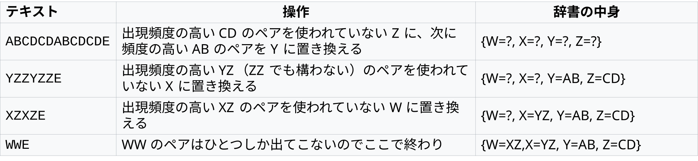
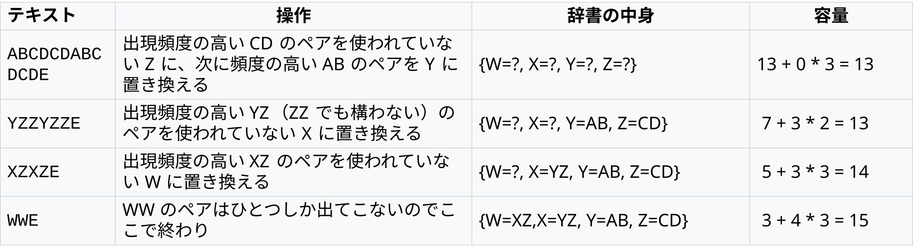
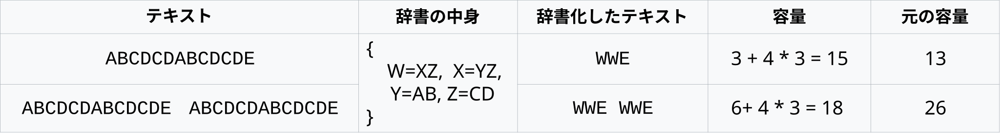
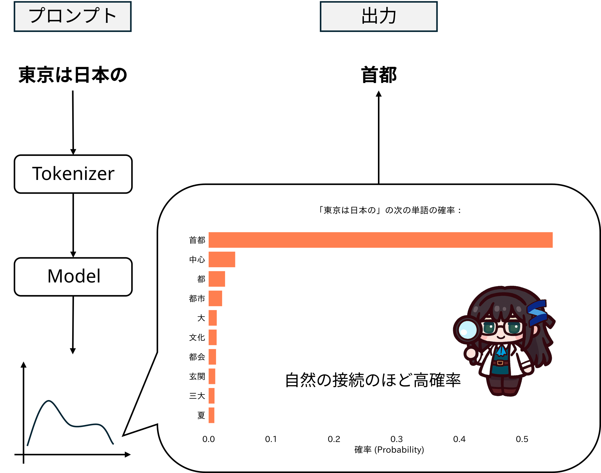
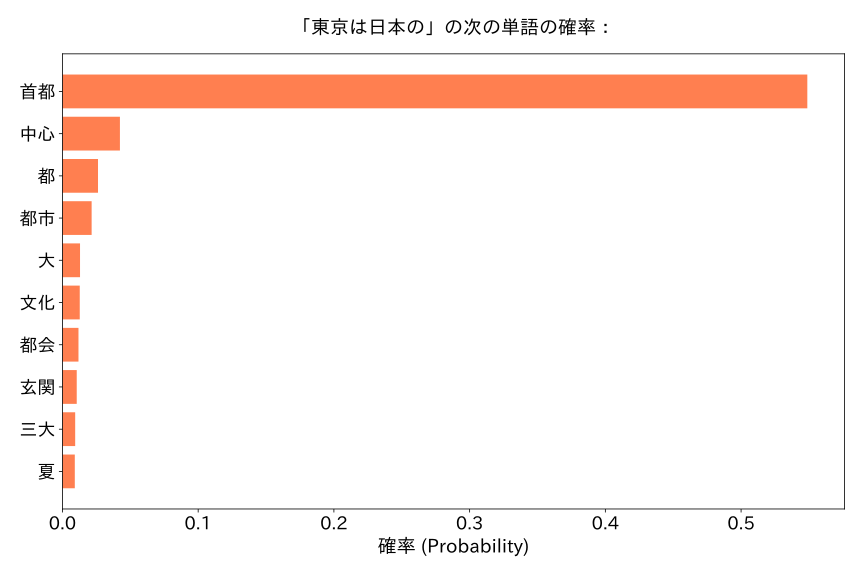
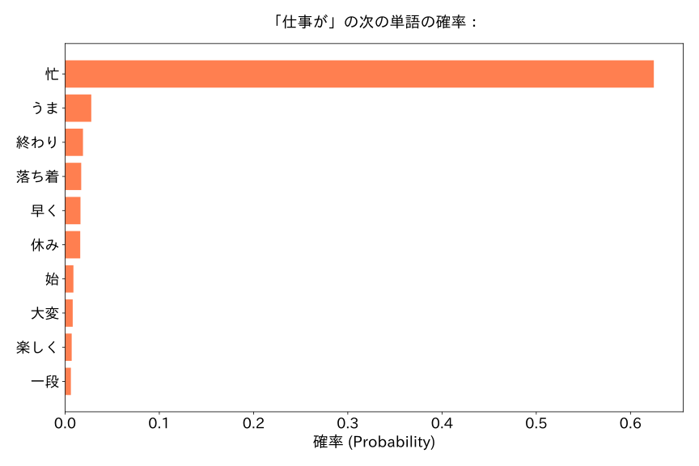
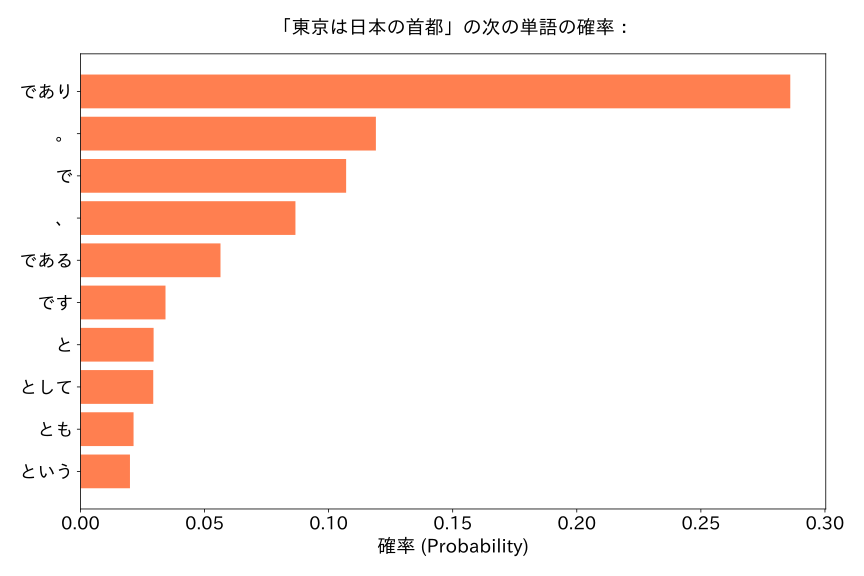
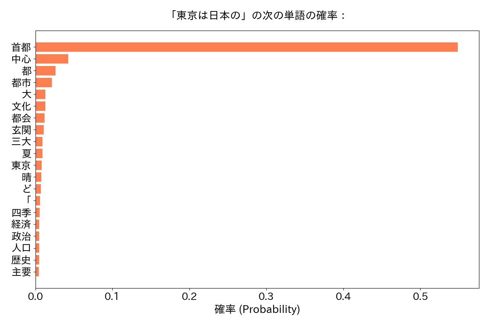
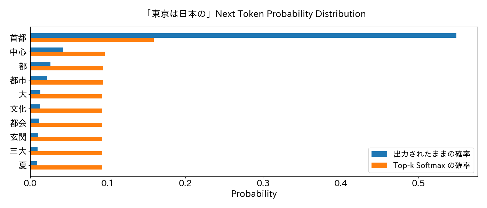
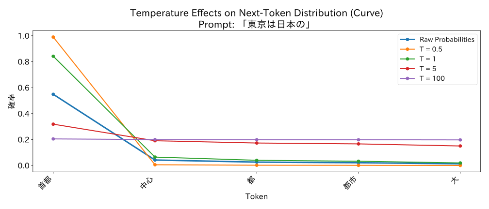

# LLM は次の単語（トークン）を予測する技術です

皆さん、言語を使っていますか？ 多分使っていない読者はいないと思います。しかし、我々が日々使っている言語というもの自体を、どうやって論理的に説明するのか、しっかり考えたことのある方はそんなに多くないと思います。例えば、以下の例を考えてみることにします。

---
我々は月に行くことを選択する

We choose to go to the moon

Мы решили отправиться на луну

വി ചൂസ് റ്റു ഗോ റ്റു ദി മൂൺ

---

これはかのケネディ大統領の有名の演説「我々は月に行くことを選択する」の、いろんな言語のバージョンです。上から日本語、英語、ロシア語と、筆者でも知らないウィキペディアで適当に拾った言語です。このように、人間にとっては言語を理解するために長い時間をかけて学習する必要があり、学習したことのない符号や言語などを理解するのは到底できないのです。それでは、パソコンに人間の言語を学習させるためには、どのような技術を必要としているのでしょうか。

## パソコンの単語：トークン

情報学科に詳しい方はすでに分かっているかもしれませんが、答えは符号化です。符号化とも言います。具体的には、文字を数字に変換して、コンピュータで扱いやすい形式にします。上記の言語のすべてが、データとしてパソコンに保存してあります。有名なのは、UTF８やJISコードなどの文字コードです。間違えると、文字化けが出てくるやつです。


上の図に示したのは、人間の言語をデータ（数字）にするとどうなるのかの一例です[1]。採用した文字コードは、皆さんにも馴染みのあるUTF8です。その上、人間の文字、それは漢字でもアルファベットでもよく知らない文字でも、全部数字に変換することが可能です。皆さん毎日使っているスマホやパソコンの中では、実は人間の言語をそのまま処理しているのではなく、こういった数字で処理しています。文字コードはまさにパソコンの言語で、数字一つひとつがパソコンの単語のようなものに等しいでしょう。

それでは、このUTF8を使って、そのままAIを訓練することは可能でしょうか？ 残念ながら、それはできません。まったくできないというわけではありませんが、著しい欠点が存在しております。それは、単語の量が多すぎるということです。例えば、実際の開発でよくつかわれるUnicodeでは、収録可能の符号位置は111万4,112個あり、現在使われている数だけでも１６万弱に達しています[3, 4]。つまり、パソコンは１６万の単語を保有する言語を扱うことになります。もちろん単語の数が少ないほど、言語が学習しやすいのは言うまでもなく、Unicodeのような文字コードをそのまま使うと、学習する難易度が著しく高まることが予想されるでしょう。

それでは、情報量を保持しつつ、単語の数を減らす方法は存在するのでしょうか？ 実は、存在しています。それは、バイト対符号化（ＢＰＥ）[2]のような、テキスト圧縮アルゴリズムです。皆さんがフォルダをＺＩＰファイルにするときに、記録した情報量が変わったわけではない（元に戻せる）にも関わらず、ディスク容量は確実に節約することができます。ＢＰＥの名前は一見難しそうですが、ふたを開けたら、そんなに難しいことをやっていません。ウィキペディアの例[5]を引用し、説明していきます。


一行目の、```ABCDCDABCDCDE```は元の文で、これを圧縮していきます。この文にはアルファベットが合計１３個があり、その中に、```AB``` のような対（ペア）が二回、```CD```のような対が四回現れました。こういった出現頻度が２以上の対に、新たな符号を与えます。例えば、```AB```を```Y```にし、元の文の中の```AB```の部分を全部```Y```に書き換えることにより、長さを二分の一にできます（もう一つの例として、もしある文```ABABAB```が存在して、```Y```を代入すると、```YYY```になるはずです。これで一気に半分くらい短縮することができました）。```{Y = AB, Z = CD}```を第一行目のテキストに代入すると、二行目のテキストが出てきました。ここでさっきと同じ操作、すなわちよく出てくる対を探します。第二行目では、よく出てくる対は```YZ```ということで、新たな```X <- YZ```として辞書に追加し、第三行の文が出てきました。最終行の文の中の唯一の対は```WW```で、しかも出現頻度は一回しかありません。ここで、アルゴリズムを終了とします。

この例では一見いい感じに圧縮できていますが、ここで違和感を覚えている方は極めて鋭いです。



１３個のアルファベットの文を三つのアルファベットに圧縮するのはいいですが、忘れてはいけないものがあります。そう、辞書そのものの容量がかかります。もし辞書の容量も計算すると、なんと１３個のアルファベットを圧縮するために、15個のアルファベットを消費しました。これでは逆に容量を増えているではありませんか？ しかし、別にこれはBPE技術が無意味なものというわけではなく、あくまでもウィキペディアの例が誤解しやすいだけです。例えば、元の文が二倍長さになる場合はどうなるでしょうか：



同じ辞書を使う場合、取り扱う文の長さを倍にしても、辞書の長さが不変であることは明らかです。しかし、辞書で極端に圧縮したことにより、文の長さが二倍になったにもかかわらず、圧縮後の全体の容量は１８しか消費していません。この場合、元は26個のアルファベットを消費するはずだったので、データを圧縮できたことがわかります。もし、文がさらに長くなると、こういった圧縮の効果がより顕著になるでしょう。

これで、一見落着になるかと思いきや、実はもう一つ問題が残っています。ウィキペディアの例の第四行目をよく見てください。辞書の中に、```W, X, Y, Z```が含まれていって、```E```がそのまま残っています。こういう辞書作りをするときに、漏らさないために、その辞書は理論的な最小サイズが存在しております。カッコ良く言い換えれば、「数学的な下限」が存在しております。しかし、この最小サイズが実は結構小さいもので、例えば、「吾輩は猫である」の全部を符号化するために、128個の単語さえあれば十分です（別に単語の数が少ないほうがいいわけではありません、あくまでも人間の言語が案外に圧縮できるということの一例です）。それでは、もし、その辞書の中に存在していない単語が出できたら、どういうことが起こるのでしょうか。言うまでもなく、取り扱えません。エラーが出てきます。これが昔の言語モデルが、絵文字などのデータを処理するときに性能が悪い一因にもなっています。

一端話をまとめると、より効率のいい文字コードを作るために、バイト対符号化（ＢＰＥ）がよく使われています。ＢＰＥとはデータを圧縮する技術であり、言語処理においては、数字化した人間の言語の中からよく出てくるパターンをかき集め、パソコン用の辞書を作ることです。こういう人間の言語を逐一パソコンの単語に変換するものは、かの有名な**Tokenizer**で、パソコンの単語の正式名称も**Token**となります。

それでは、実際にTokenizerを体験してみましょう。これから、少々コードが出てきます。分かりやすいように書いているので、ご心配なく。

とりあえず、Tokenizerを作るためには、元になるテキストが必要です。ここで、生み出すテキストを元に戻してみましょう：

```python
from 有用なスクリプト import load_txt
for sentence in load_txt(path="./吾輩は猫であるutf8.txt")[:10]:
    if len(sentence) > 1:
        print(sentence if len(sentence) < 50 else sentence[:50]+"　（以下略）")
```
そして出力は『吾輩は猫である』の一部です
```
吾輩は猫である

夏目漱石

　吾輩《わがはい》は猫である。名前はまだ無い。

　どこで生れたかとんと見当《けんとう》がつかぬ。何でも薄暗いじめじめした所でニャーニャー泣いていた事　（以下略）
　この書生の掌の裏《うち》でしばらくはよい心持に坐っておったが、しばらくすると非常な速力で運転し始め　（以下略）
　ふと気が付いて見ると書生はいない。たくさんおった兄弟が一｜疋《ぴき》も見えぬ。肝心《かんじん》の母　（以下略）
　ようやくの思いで笹原を這い出すと向うに大きな池がある。吾輩は池の前に坐ってどうしたらよかろうと考え　（以下略）
　吾輩の主人は滅多《めった》に吾輩と顔を合せる事がない。職業は教師だそうだ。学校から帰ると終日書斎に　（以下略）
　吾輩がこの家へ住み込んだ当時は、主人以外のものにははなはだ不人望であった。どこへ行っても跳《は》ね　（以下略）
```
これはすでにGitHubで用意されているテキストファイルです。それでは、実際にTokenizerを作ってみましょう。具体的な実装方法は割愛します。興味のある方は```有用なスクリプト.py```に参照してください。重要なことは、Tokenizerを訓練するために必要な要素は、テキストとほとんど任意に指定できる辞書の大きさだけです。
```python
from 有用なスクリプト import train_tokenizer

tokenizer = train_tokenizer(
    file_path="./吾輩は猫であるutf8.txt",   # テキスト元になるファイル
    vocab_size=5000,                       # 辞書の大きさ
    text_to_compress = "吾輩わがはいは猫である。名前はまだ無い。"
)
```
このコード出力結果として、以下のものが出てくるはずです：
```
Tokenizerの指定単語数は 5000...
訓練完了

--- テキスト容量比較 ---
比較用サンプル: '吾輩わがはいは猫である。名前はまだ無い。'

[UTF-8 容量]
  bytes: 60
  bits (bytes * 8): 480

[BPE 容量]
  辞書容量: 5000
  トークンごとのbits密度 (ceil(log2(vocab_size))): 13
  トークン数: 10
  トークン: [315, 2459, 535, 144, 4662, 142, 1873, 3784, 3646, 142]
  bits (トークン数 * bits_per_token): 130

--- 📊 最終結果 ---
UTF-8 Bits: 480
BPE Bits:   130
-> 圧縮比率: 3.69 (UTF-8 bits / BPE bits)
```
「吾輩わがはいは猫である。名前はまだ無い。」の一言を符号化するために、UTF８（Unicode）なら480 bitsを消費するのに対して、BPEが辞書の大きさが5000の状態で130bitsしかかかりません。これは大きな圧縮効果です。

次に、このトークンが元のテキストに戻れるかどうかを試してみましょう。人間の理解できる言語に戻せないなら、意味がないからです。：
```python
適当な文章 = "論文を書くのは辛い El Psy Congroo 🥺"
print("適当な文章:\t", 適当な文章)
トークン = tokenizer.encode(適当な文章).ids
print("トークン: \t", トークン[:15])
日本語文書 = tokenizer.decode(トークン)
print("復元した日本語:\t", 日本語文書)
```
出力として：
```
適当な文章:  論文を書くのは辛い El Psy Congroo 🥺
トークン:    [4114, 3431, 158, 349, 2909, 132, 93, 36, 93, 42, 48, 93, 39, 38, 32]
復元した日本語:  論文を書くのは辛い l sy ongroo ���
```
が出てきました。これはバグではなく、先ほど説明した通り、Tokenizerは与えたテキスト元の中に存在している単語しか処理できないため、今回のようなアルファベットや絵文字を含むテキストをうまく復元することができません。夏目先生は絵文字や英語など使っていないので、代表作から生み出されたTokenizerが絵文字の処理能力がないのも当然です。それでは、夏目先生の作品以外に、いろいろなデータを足しましょう：

```python

tokenizer = train_tokenizer(
    file_path=[
        "./吾輩は猫であるutf8.txt",
        "./text/emoji.txt",
        "./text/harry potter 1.txt"
    ],   # テキスト元になるファイル
    vocab_size=5000,                       # 辞書の大きさ
    text_to_compress = "吾輩わがはいは猫である。名前はまだ無い。"
)
print("----------------------------")
適当な文章 = "論文を書くのは辛い El Psy Congroo 🥺"
print("適当な文章:\t", 適当な文章)
トークン = tokenizer.encode(適当な文章).ids
print("トークン: \t", トークン[:15])
日本語文書 = tokenizer.decode(トークン)
print("復元した日本語:\t", 日本語文書)
```
そして
```

Tokenizerの指定単語数は 5000...
訓練完了

--- テキスト容量比較 ---
比較用サンプル: '吾輩わがはいは猫である。名前はまだ無い。'

[UTF-8 容量]
  bytes: 60
  bits (bytes * 8): 480

[BPE 容量]
  辞書容量: 5000
  トークンごとのbits密度 (ceil(log2(vocab_size))): 13
  トークン数: 13
  トークン: [460, 3696, 813, 167, 808, 324, 164, 2836, 167, 1158, 566, 151, 164]
  bits (トークン数 * bits_per_token): 169

--- 📊 最終結果 ---
UTF-8 Bits: 480
BPE Bits:   169
-> 圧縮比率: 2.84 (UTF-8 bits / BPE bits)
----------------------------
適当な文章:  論文を書くのは辛い El Psy Congroo 🥺
トークン:    [988, 944, 346, 1700, 187, 511, 4384, 151, 112, 26, 51, 112, 32, 58, 64]
復元した日本語:  論文を書くのは辛い El Psy ongroo 🥺

```
＃　要修正

絵文字が普通に処理できました。しかし、英語のデータを導入しても、「Congroo」という単語が復元できませんでした。理由は言うまでもなく、追加した英語データセットはハリーポッターなので、その中に「Congroo」という単語が存在していないのです。単語漏れの現象は自然言語においては、元のデータセットにデータをバンバン充填したら、ある程度解決できます。しかし、最近のAIを使っている方はよくご存知のように、AIに画像を入力することもできます。画像を入力する際に、やはりトークンに変換する必要があり、その変換の中にある程度の情報紛失は避けられません。興味のある方は付録に参照してください。本編では、主に自然言語だけを対象として進みます。

一言でこれまでの話をまとめると：Tokenizerという人間の言語をToken（数字）に変換するものがあって、それがLLMの重要な基礎となります。それでは、いよいよLLMの部分に入るとしましょう。

## 大規模言語モデル

### 次の単語へ

言語モデルについて話す前に、とりあえず簡単なウォーミングアップをしましょう：

```python
パターン１ = [1, 2, 3, 4, 5, ...]
パターン２ = [1, 4, 9, 16, 25, ...]
パターン３ = [1, 2, 4, 8, 16, ...]
```

ここに三つの数列があって、それぞれ最初の五つだけ数がわかっています。それでは皆さん、この三つのパターンの次にどの数字が出るかを当ててみてください。何だこりゃ、と思っている方もおられるかもしれませんが、確かこれは幼稚園レベルの問題で、パターン１は自然数の増加列、パターン２は完全平方数の増加列で、最後のは２の指数の数列です。

しかし、よくよく考えたらこれは変ではないでしょうか。なぜ無限の可能性のある数列から、たった五つの数字だけで、数列全体のパターンを決めつけることができるのでしょうか。そう思われた方は鋭いです。こういう問題の暗黙の了解として、数列が何らかしらのルールに則っていて、そしてそのルールというものが有限の観察から推理できると仮定しています。

しかし、こういう観察は完備な証明と異なり、推理したルールが全体に当てはまる保証はありません。例えば、パターン１は実は下記のようなものかもしれません。
```python
def パターン１(x: int):
    # ｘが１から５の時、ｘしか値として戻っていない；
    return x + (x - 1) * (x - 2) * (x - 3) * (x - 4) * (x - 5) 

新パターン１ = [パターン1(x) for x in range(1, 7)]
print("新パターン１ ->", 新パターン1)
```
その結果は当然、
```
新パターン１ -> [1, 2, 3, 4, 5, 126]
```
になります。有限の観察から、絶対的に正しい推理をすることはできません。しかし、もし観察した数がたった五つの数字ではなく、何十億回何百億回の観察を積み重ねて、そこから得られる推理ならどうでしょうか。五つの観察から得られた知見より、よほど真のパターンに近づいているといえるでしょう。

ここで、言語モデルの話に戻ります。**なぜ次の数字を当てることが言語モデルとかかわっているのでしょうか？**

上記の通り、文書を符号化することができます。それでは、文書とTokenizerで符号化したTokenを並べてみましょう：
```python
文書 = "月がきれい"
for idx in range(0, len(文書)):
    文書断片 = 文書[: idx + 1]
    tokens = tokenizer.encode(文書断片)
    print( 文書断片, "　" * (len(文書) - idx),":", end=" ")
    print(tokens.ids)
```
すると
```
月 　　　　　 : [493]
月が 　　　　 : [493, 170]
月がき 　　　 : [493, 170, 230]
月がきれ 　　 : [493, 170, 230, 199]
月がきれい 　 : [493, 170, 230, 199, 151]
```

左側は文書が一文字ずつ出てきていて、右側はそれのToken化したものです。人間が順番に文書を読むように、言語モデルも逐次的にTokenを左から右まで“観察”することができます。文法のような、人間の言語の裏にあるパターンが、数字のパターンに書き換えられます。すなわち、文書の続きを予測することが、数列当てのような、数字だけの予測に書き換えることができます。

ChatGPTやGeminiなどのよく知られている言語モデルも、実はこのように作られています。どれだけ複雑な機能があっても、数学の問題が解けようが、翻訳ができようが、その動きを観察すると、やはりこういう数字当て的なものに帰結します。

### 大規模言語モデルを観察しよう

今の大規模言語モデルのコミュニティの中にたくさんのモデルが出てきています。この一節で、既に訓練積みのモデルは、どのような要素があって、最終的に次のトークンが予測できるようになるのかを軽く触れたいと思います。各パーツをバラバラにして、機能を究明し、そして元に組み立てられるかどうかを試してみます。（解剖して組み立てるもよし、他のパーツに交換して、フランケンシュタインにするのもできますが、その部分はモデルの訓練に関係があり、具体的には付録に記載しています。）

それでは、実際のLLMの動作を観察してみましょう。これから主に使うモデルは```google/gemma-3-1b-pt```[8]です。名前から察するに、グーグルが開発した、gemmaというモデルの第三世代です。モデルの中のパラメータの数は百万個（１ｂ）程度で、事前学習だけをしたモデルです。この「事前学習」は、現代のLLMの訓練において非常に重要な手法です。現代のLLMの訓練を大まかに説明すると、とりあえず大量のデータをかき集めて、そのデータで大体的な言語のルールを学習させます。そこから、高品質のデータを投入し、色々な機能を付け加えます。

それでは、公式の実装でとりあえず試してみましょう：

```python
from transformers import pipeline
import torch

ckpt = "google/gemma-3-1b-pt"
pipe = pipeline(
    "text-generation", 
    model=ckpt, 
    # device="cuda",  # １ｂのモデルは、GPUが無くでも、CPU単体でも使える
    torch_dtype=torch.bfloat16
)
output = pipe("東京は日本の", max_new_tokens=20)
print(output[0]['generated_text'])
```
その出力は
```
Device set to use cpu
東京は日本の首都として、1871年に日本国憲法によって首都に指定され、明治時代
```
になります。この結果を観察すると、文法的な過ちはありませんが、１８７１（明治４年）の出来事は岩倉使節団の派遣決定と廃藩置県です。その翌年、「立国憲議（憲法制定の建議）」が提案され、明治22年大日本帝国憲法が公布され、明治２３年から施行されました。また、東京が日本の首都になった（東京遷都）のは、明治元年から明治二年の出来事であり、別に憲法に指定されているわけではありません[10]。

失礼、話が少々ずれていますが、要するに、この１ｂのモデルは事実的な誤りがありつつも、十分自然な日本語を出力することができます。では、一回だけではなく、観察の回数を増やして、その動作を確かめていきましょう：

```python
for idx in range(1,4):
    output = pipe("東京は日本の", max_new_tokens=20)
    print(f"トライアル{idx}:",output[0]['generated_text'], end="\n---------------\n")
```
この出力は
```
トライアル1: 東京は日本の首都で、大都市の中でも人口の多いエリアの一つです。東京は日本を代表する観光
---------------
トライアル2: 東京は日本の首都であり、日本で最も人口が多い都市です。

東京は日本の首都であり、日本で
---------------
トライアル3: 東京は日本の首都、そして世界でも有数の観光地です。東京は多くの観光スポットがあり、その中でも
---------------
```
あれ、おかしいぞ。なんで毎回出てくる解答が異なるのでしょうか？ しかし、よく考えれば当然のことではないでしょうか？ ChatGPTに同じ質問を投げることで、必ずしも同じ解答が出てくるわけではありません。それじゃあ、このようなランダム的な動きの原理は何でしょうか？ それを究明するために、このLLMをばらけさせましましょう。そうすれば、答えが自然に出てくるはずです。

### LLMの内部に何が起こっているか

LLMの中に発生した出来事を、上の図で示しています。まず、プロンプトというユーザーからの入力が与えられ、そのプロンプトがTokenizerにより、トークンとなります。そして、モデルがそのトークンを取り込んで、次のトークンの確率を出力します。その「次のトークンの確率」というのは、辞書の中のすべての単語が、プロンプトの次に現れる確率のことです。そして、高い確率の候補から、良さそうな単語を拾って、元のプロンプトにくっつけちゃえば、新たなプロンプトの出来上がりです。これを何度も繰り返すことで、長文の生成が可能になります。

この図を完全に理解している方は、すでにLLMに相当理解していると思います。その中に、LLMの中身を過度に簡略化しているのではないかと疑問をもっている方もいるでしょう。しかし、あえてそうするのは理由があります。モデルの内部にいかなる仕組みを取り入れようとも、その目的はただ一つ、次のトークンを予測するということに変わりはありません。この唯一の前提条件だけに依存するのは、今回紹介している電子透かし技術です。LLMのコミュニティはここ数年で発展し、次々と新しいモデルが発表されています。その中に、もし電子透かしがモデルの中身の特定な仕組みに依存すれば、その透かしの互換性を大いに損ねるのでしょう。だからあえて、モデルの中身に依存せず、あくまでも根本的な原理に依存するように設計していました。

それでは、具体的にどうやっているのかを、コードで見て見ましょう：
```python
#　huggingface からモデルを引っ張て使います
from transformers import AutoTokenizer, AutoModelForCausalLM

# 使うモデルを　google/gemma-3-1b-pt　に指定
ckpt = "google/gemma-3-1b-pt"
tokenizer = AutoTokenizer.from_pretrained(ckpt)
model = AutoModelForCausalLM.from_pretrained(ckpt)

# 1. プロンプト
prompt = "東京は日本の"

# 2. プロンプトをトークン化、ここのinput_idsは整数のリストです
input_ids = tokenizer(prompt, return_tensors="pt").input_ids

# 3. モデルに適用する
with torch.no_grad(): 
    outputs = model(input_ids)

# 4. 最後の出力を抽出する
next_token_logits = outputs.logits[0, -1, :]

# 5. 確率を計算する
next_token_probs = torch.softmax(next_token_logits, dim=-1)

# 6. 図として、出力
visualize_next_token_distribution(next_token_probs, tokenizer, top_k=10)
```
そこで、出てきた結果は



ここで分かったことは、「首都」という単語が半分以上の確率を誇っているということ、他の候補の「中心」や「都市」などもちゃんと日本語として文法的な間違いはないということです。この現象の原因は、訓練用のデータセットの中に、このような組み合わせがよく出てきて、正しい文書を習得しているサインです。おまけにこういう面白い現象が観察できました:


なんと、訓練用のデータセットでは、「東京は日本の首都」より「仕事が忙しい」の全体的確信度が高いそうです。gemmaの訓練用データは結構ブラックですね。モデルの出力が、与えたデータセットに密に関係があるということです。

また、必ずしも確率が最も高いものを選ばなくでもいいです。例えば

の場合、話はすでに分岐点となり、どの選択も文法的な誤りがないし、どのトークンを次のトークンを選択しても問題ありません。ここに出てくるのはトークンサンプリングです。具体的には、文法に間違いいない限り、モデルのトークン選択の範囲を拡大するという話です。最大の確率のトークンにこだわる必要がありません。むしろよりマイナーな、滅多に使われていないトークンを選んだ方が創造力があるかもしれません。それでは、全部二番目のトークンで、簡単に文書を作ってみましょう。
```python
from transformers import LogitsProcessor
import torch

class SecondLargestLogitsProcessor(LogitsProcessor):
    def __call__(self, input_ids: torch.LongTensor, scores: torch.FloatTensor):
        top2 = torch.topk(scores, k=2, dim=-1)

        # top2.values[:, 0] -> largest
        # top2.values[:, 1] -> second largest
        # top2.indices[:, 1] -> index of second largest logit

        # Create all -inf
        new_scores = torch.full_like(scores, float("-inf"))

        # Set only the 2nd-largest index to 0 so argmax picks it
        second_idx = top2.indices[:, 1]
        new_scores[torch.arange(scores.size(0)), second_idx] = 0.0

        return new_scores

prompt = "東京は日本の"
processor = SecondLargestLogitsProcessor()
max_new_token = 18
for i in range(max_new_token):
    model_inputs = tokenizer(prompt, return_tensors="pt").to(model.device)

    input_len = model_inputs["input_ids"].shape[-1]

    with torch.inference_mode():
        generation = model.generate(
            **model_inputs,
            max_new_tokens=1, 
            logits_processor=[processor]
            )
        generation = generation[0][input_len:]

    decoded = tokenizer.decode(generation, skip_special_tokens=True)
    
    prompt += decoded
print(prompt)
```
出力は
```
東京は日本の中心地として発展し続けてきた。東京の歴史を振り返ってみよう！
```
なるほど、もっと面白みが出てきたような気がします。すると、もっと巧みのコントロール手法が存在しているのでしょうか？ 実は存在しています。例えば```temperature```や```Top-K```などのパラメータが、それと関係があります。
### 多岐にわたるサンプリング手法

これまで説明したように、モデルが次に出てくるトークンの可能性を計算してくれます。その可能性の分布から次のトークンを選ぶのは、いろんな手法が使えます。最も簡単なのは、一番高い確率のトークンだけを選ぶ手法です。しかし、これを使うと同じ問題に同じ返答しかできないという致命的な欠点があります。だから、```top-k```や```temperature```などの手法が提案されたわけです。

#### top-k

top-k というのは、低い確率の候補を切り捨て、より正しい確率分布に修正する手法です。例をもって説明していきます。例えば、さっきのプロンプト（"東京は日本の"）の場合、候補トークンリストのトップ１５個を図にすると、このようになります：

上の方の候補は良さそうですが、徐々に変なものが出てきましたね。例えば、「東京」という候補トークンが十一位にあって、「東京は日本の東京」という謎構文になります。すなわち、確率の低いトークン候補は不自然な言語に導くこともあります。そこで、確率の低いものを切り捨て、もう一回確率を整えるのです。こういう処理がされた後、

こうなります。とりあえず低い確率が切り捨てられました、それと、Softmaxを使ったから、トップK個の中の確率が再編成されていました。こういう操作により、モデルが安全な範囲（TOP-K）の中で、もっと多様な選択をしてくれるはずです。

#### temperature
一言でいうと、```temperature```は分布をよりシャープしたり、より平均化したりするパラメータです。


温度がゼロに近いと、より元の確率が高いトークンがより選ばれるようになります。逆に、温度が高くなるにつれてより平均化されます。すなわち、確率が低いトークンが選べる確率が上昇します。

----
これまでの話を整理しましょう：
1. 大規模言語モデルは、次のトークンを予測してくれるプログラムです。次のトークンの予測とは、辞書の中のすべての単語の、次に出現する確率を計算することです。
2. いろんなサンプリング手法があり、それらを活用すればLLMの行動を制御することができます。

### LLMの機能を拡張せよ
ここまでで疑問を持った読者もいるでしょう。このような次の単語を予測するだけのモデルでは、普段使っているChatGPTと差がありすぎるのではないか。それは、このモデルがまだ高品質のデータでFine-tuningしたことがないからです。このFine-tuningというのは、モデルの機能拡張ととらえてもらっても問題ありません。例えば、数学の専門的なデータを用いて計算能力をある程度モデリングしたり、構造化出力を担保するために強化学習したりするなど、色々な手法を積み重ねてようやく使えるものになります。しかし、その原理を追求すると、やはり根っこの部分にあるのは、次の単語（トークン）を予測する技術に変わりありません。

例えば、コードを生成する機能をLLMに学習させるためには、それを目的とするデータセットでFine-tuningするのはよくあるやり方です。この場合のデータセットは、このようなものがよく使われています[11]：
```
Below is an instruction that describes a task. Write a response that appropriately completes the request.

### Instruction:
Create a function to calculate the sum of a sequence of integers.

### Input:
[1, 2, 3, 4, 5]

### Output:
# Python code
def sum_sequence(sequence):
  sum = 0
  for num in sequence:
  sum += num
  return sum
```
こういうデータセットはある意味、実際のユースケースを、機械に学習させているともいえるでしょう。それでは、Instruction Tuningを経たLLMを、実際に使ってみましょう。

まずはこれまで通り、モデルをHuggingfaceから引っ張り出します
```python
from transformers import AutoTokenizer, AutoModelForCausalLM

tokenizer = AutoTokenizer.from_pretrained("google/gemma-3-1b-it")
model = AutoModelForCausalLM.from_pretrained("google/gemma-3-1b-it")

```
今までと異なり、モデルを```google/gemma-3-1b-pt```から```google/gemma-3-1b-it```に変更します。それから、プロンプトを入力してtokenizerでトークンに変換しますが、instruction tuningするモデルでは、一工夫が必要になります。：
```python

PROMPT = """
Below is an instruction that describes a task. Write a response that appropriately completes the request.

### Instruction:
Create a function to calculate the sum of a sequence of integers.

### Input:
[1, 2, 3, 4, 5]
"""

messages = [
    {"role": "user", "content": PROMPT},
]
inputs = tokenizer.apply_chat_template(
  messages,
  add_generation_prompt=True,
  tokenize=False,
  return_tensors="pt",
)
print(inputs)
```
ここの```PROMPT```はそのままプロンプトですが、```tokenizer.apply_chat_template```は何でしょうか？ この部分をプリントして観察してみましょう：
```
<bos><start_of_turn>user
Below is an instruction that describes a task. Write a response that appropriately completes the request.

### Instruction:
Create a function to calculate the sum of a sequence of integers.

### Input:
[1, 2, 3, 4, 5]<end_of_turn>
<start_of_turn>model
```
なるほど、このようにプロンプトの中で、ユーザーからの指示（Instruction）とモデルの出力を見分けることができるようになっています。ここで、いくつかの特殊トークンが出できました。
| トークン         | 全称                       | 意味 |
| -------------   | -------------             |-------------|
| bos             | begining of the sequence  |文書の先頭　　　|
| start_of_turn   | start of the turn         |俺のターン☆　　　|
| end_of_turn     | end of teh turn           |ターン終了　　　|
| eos             | ending of the sequence    |文章の終わり　　　|

特殊のトークンといっても、あくまで有用性をよくするためのマークのようなものです。それでは、このマーク付きプロンプトをトークン化し、実際に答えを生成してみましょう。
```python
max_new_token = 128

prompt = PROMPT

input_ids = tokenizer(prompt, return_tensors="pt").input_ids.to(model.device)

for _ in range(max_new_token):
    with torch.inference_mode():
        outputs = model(input_ids)
        next_token_logits = outputs.logits[:, -1, :]   # shape: [1, vocab]
        
        next_token_id = torch.argmax(next_token_logits, dim=-1).unsqueeze(-1)

    # 2. Append new token (no decoding)
    input_ids = torch.cat([input_ids, next_token_id], dim=-1)

outputs = tokenizer.decode(input_ids[0], skip_special_tokens=True)
print(outputs)
```
ここではあえて自作の実装をして、LLMの次のトークンを予測する本質的な部分を体感したいと思います（対価として、やや重い）。そして、出力されるものは下記のようになります：
```python
<bos><bos><start_of_turn>user
Below is an instruction that describes a task. Write a response that appropriately completes the request.

### Instruction:
Create a function to calculate the sum of a sequence of integers.

### Input:
[1, 2, 3, 4, 5]<end_of_turn>
<start_of_turn>model
```python
def sum_sequence(sequence):
  """
  Calculates the sum of a sequence of integers.

  Args:
    sequence: A list of integers.

  Returns:
    The sum of the integers in the sequence.
  """
  total = 0
  for number in sequence:
    total += number
  return total

# Example usage:
sequence = [1, 2, 3, 4, 5]
result = sum_sequence(sequence)
print(result)  # Output: 15
```<end_of_turn><end_of_turn><end_of_turn> प्रकारे
```
結構様になりますね。この出力から、とりあえず特殊トークンがしっかり機能していて、\<end_of_turn\>が出たということは、この生成が無限に続くわけではないということで、これは望ましいです。その上、出力しているコードは正しいものなので、有用性が実証されているともいえるでしょう。
そして、公式の実装を使って、こういう風に書き換えることができます：
```python
input_tokens = tokenizer.encode(inputs, return_tensors="pt")
outputs = model.generate(input_tokens, max_new_tokens=128, temperature = 0.01)
print(tokenizer.decode(outputs[-1]))
```
こっちの方が断然早いし、おすすめです。公式の実装はKV-Cacheという手法を使っていって、劇的に時間計算量を減らすことができます。

------
これまでの話をまとめると、LLMは次のトークンを予測してくれる技術で、具体的には次の単語の確率分布を出力します。その出力は大まかに自然言語のルールを従い、文法的におおよそ正しい単語の確率が高いです。この性質が、大規模言語モデルの透かしの基礎となります。一見多種多様な機能がもっているLLMも、実のところ、次のトークンを一つひとつ予測するだけです。

みなさんお疲れ様です。本節は長かったですよね。しかし、本節の内容を理解すると、普段ChatGPTのようなサービスを使う際に何か新しい感情が湧くかもしれません。そうなったらうれしいことこの上ないです。それでは、次にいよいよLLMの透かしに入りましょう^_^

参考文献：

[1]https://www.edu.i.hosei.ac.jp/~sigesada/kyouzai/mojicodehenkan.html

[2]Radford, Alec, et al. "Language models are unsupervised multitask learners." OpenAI blog 1.8 (2019): 9.

[3]https://ja.wikipedia.org/wiki/Unicode

[4]https://www.unicode.org/versions/Unicode16.0.0/UnicodeStandard-16.0.pdf

[5]https://ja.wikipedia.org/wiki/バイト対符号化

[6]https://huggingface.co/learn/llm-course/chapter6/5#:~:text=For%20real%2Dworld,emojis%2C%20for%20instance.

[7]https://magazine.sebastianraschka.com/i/168650848/gemma

[8]https://huggingface.co/google/gemma-3-1b-pt

[9]https://ja.wikipedia.org/wiki/大日本帝国憲法

[10]https://www.mlit.go.jp/kokudokeikaku/iten/service/newsletter/i_02_77_2.html

[11] https://huggingface.co/datasets/iamtarun/python_code_instructions_18k_alpaca

[12] https://qiita.com/ishikawa-takumi/items/5fc45ddd121b23db5de9

