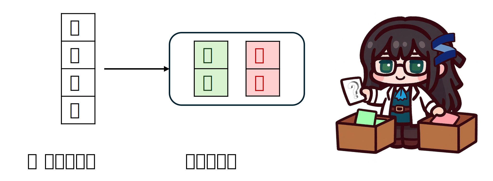

# 電子透かしとは？

とりあえず、実例を見てみよう。プロンプトとして、「『自由』は何ですか？」を与えて、以下の二通りの答えが作れます。
```
(Sample 1) “自由”という言葉は、非常に幅広い意味を持つ概念です。それは、道徳的・法的・または社会的に独立した状態を指し、自分の意思に基づいて行動したり、意見を表明したり、好きなように生きることを意味します。それは、抑圧や制限を受けない場所であると同時に、自分の人生を選択し、価値観に基づいて行動できる状態とも言えます。さらに、個人的な意思決定、経済的な自由、そして他人に対する自由といった、様々な形で「自由」は定義されることがあります。<end_of_turn>

(Sample 2)「自由」とは、自律的な意思決定や行動の自由、そして、自分の人生や選択の主導権を持つことです。それは単なる物理的な自由だけでなく、抑圧や制限を受けない状態、自分の価値観や信念に基づいて行動できる能力、そして、自分の人生の方向性や目指すものを自由に設定する力を含んでいます。<end_of_turn>
```
それでがクイズです、この二つのサンプルで、どれが電子透かしが入っているでしょう。


答えを開示します：両方とも透かしが入っています。

---


なんでやねん、と思った方は少々弁明を聞いてほしいです。

ちゃんと透かしが入れていないサンプルが用意しているから
```
(Sample W/O. WM) “自由”とは、単なる「良い状態」や「良い結果」を示す言葉ではなく、非常に広い意味を持つ概念です。それは、自分の意志で行動できること、考えや感情に基づいて自由に選択できること、そして、制限や束縛から解放された状態を指します。それは、自己決定権、表現の自由、社会における公正な地位、そして、自分の人生の道を選べる権利を含む様々な側面を包含しています。<end_of_turn>
```

透かしと言えば、普段よく考えられるのは、画像でマークをこまめに入れるものでしょう。言語の場合そうはいかない、なぜなら、言語の有用性を損なうし、同じパターンを何度でも入れるのは除去するのもたやすいです。何より、こういうシンプルなパターンが一端観察された次第、偽るもたやすいでしょう。

ここで、透かしのいくつかの重要な性質が見えてきました。第一、簡単に見つからないこと。第二、簡単に偽造されないこと。


上の例を目にした皆さんは多分、第一の性質がどうやって実現しているのかを気になっているところだと思うので、さっそく種明かしをしましょう。


## 偏りのある単語帳

この前に説明した、トークンはLLMの単語という比喩を思い出してほしいです。
高校の時、みんな自分の好きな単語帳を使い、英語力を身に着けると思います。
その時、使っている単語帳により、記憶した単語ももちろん偏りが出できます。
例えば、『シス単』の中に「diameter（直径）」という単語があって、しかし『ターゲット1900』にはそれがありません。
クラスの中に、もし「diameter」という単語を知っている学生がいれば、この学生は必ず『ターゲット1900』しか使っていないということを断言できます。

LLM透かしはこの原理を活用して、偏りのある単語帳を作り出すのは第一歩です。
しかし、Tokenizerの話をまだ忘れていない方はここに疑問があるかもしれない。
LLMのTokenizerは与えられたテキストで計算されたもので、その中に何かを足してあるいは消すのは、元のデータの調整を意味する。
しかし、これは元のテキストの品質を損なう行為でもあります。

そこに注目した方はご明察です。
そもそも、訓練済みのモデルのTokenizerを調整するのは現実ではありません。
そこで使われている手法は、**トークンの振り分け**です。
例えば、二つのグループに振り分けます。
全てのトークンを、赤いトークンと緑のトークンに乱数的に振り分けることにより、もともとのトークンの集合（単語帳）が、重なりのない二つの部分集合に分けることができます。



乱数的の振り分けのため、この分け方そのものが単語帳の特性となります。
疑似乱数の性質上、分け方は乱数シードと入力するトークンリストの長さしか依存していません。
そのため、シードを暗証キーとする場合、シード無しで分け方を当てるのは至難の業です。
**もしある文書の中に、緑の単語の数が、著しく赤い単語の数を上回っているとわかったら、それが暗証キーを知っているということを意味する。**

したがって、モデルの単語帳をこうやって振り分けることより、「偏り」を作れるというわけです。それでは、コードとして、どのようなものになるのか、見てみましょう。


