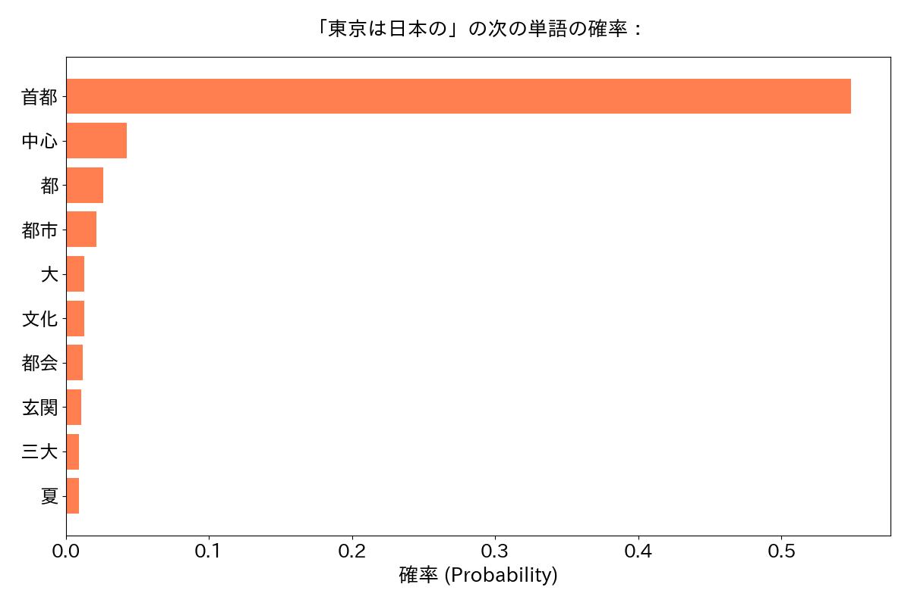
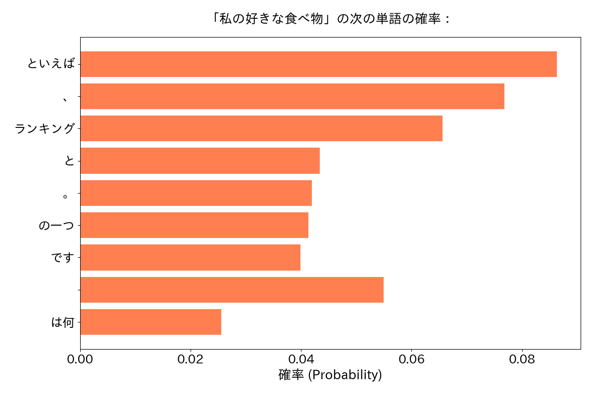
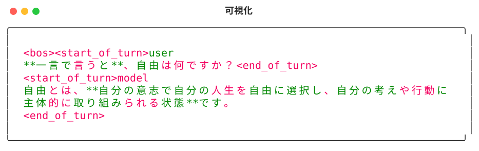
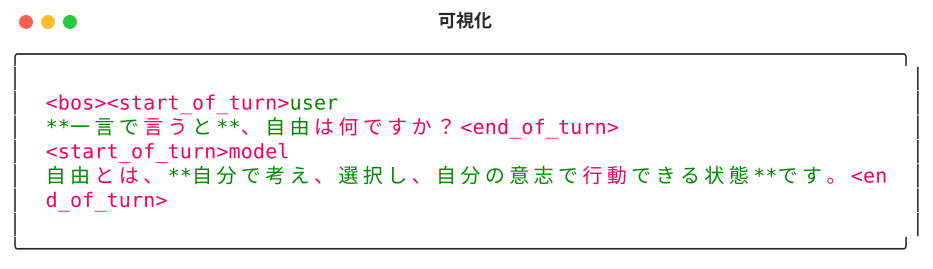
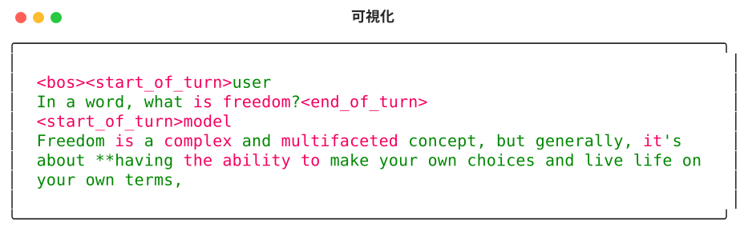
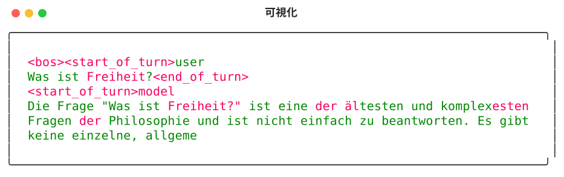
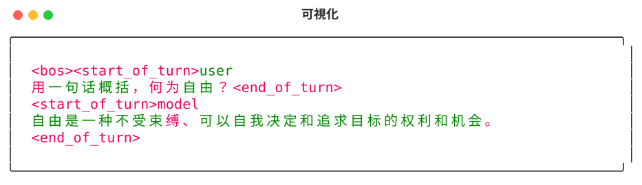

# 電子透かしとは？

とりあえず、実例を見てみよう。プロンプトとして、「『自由』は何ですか？」を与えて、以下の二通りの答えが作れます。
```
(Sample 1) “自由”という言葉は、非常に幅広い意味を持つ概念です。それは、道徳的・法的・または社会的に独立した状態を指し、自分の意思に基づいて行動したり、意見を表明したり、好きなように生きることを意味します。それは、抑圧や制限を受けない場所であると同時に、自分の人生を選択し、価値観に基づいて行動できる状態とも言えます。さらに、個人的な意思決定、経済的な自由、そして他人に対する自由といった、様々な形で「自由」は定義されることがあります。<end_of_turn>

(Sample 2)「自由」とは、自律的な意思決定や行動の自由、そして、自分の人生や選択の主導権を持つことです。それは単なる物理的な自由だけでなく、抑圧や制限を受けない状態、自分の価値観や信念に基づいて行動できる能力、そして、自分の人生の方向性や目指すものを自由に設定する力を含んでいます。<end_of_turn>
```
それでがクイズです、この二つのサンプルで、どれが電子透かしが入っているでしょう。


答えを開示します：両方とも透かしが入っています。

---


なんでやねん、と思った方は少々弁明を聞いてほしいです。

ちゃんと透かしが入れていないサンプルが用意しているから
```
(Sample W/O. WM) “自由”とは、単なる「良い状態」や「良い結果」を示す言葉ではなく、非常に広い意味を持つ概念です。それは、自分の意志で行動できること、考えや感情に基づいて自由に選択できること、そして、制限や束縛から解放された状態を指します。それは、自己決定権、表現の自由、社会における公正な地位、そして、自分の人生の道を選べる権利を含む様々な側面を包含しています。<end_of_turn>
```

透かしと言えば、普段よく考えられるのは、画像でマークをこまめに入れるものでしょう。言語の場合そうはいかない、なぜなら、言語の有用性を損なうし、同じパターンを何度でも入れるのは除去するのもたやすいです。何より、こういうシンプルなパターンが一端観察された次第、偽るもたやすいでしょう。

ここで、透かしのいくつかの重要な性質が見えてきました。第一、簡単に見つからないこと。第二、簡単に偽造されないこと。


上の例を目にした皆さんは多分、第一の性質がどうやって実現しているのかを気になっているところだと思うので、さっそく種明かしをしましょう。


## 偏りのある単語帳

この前に説明した、トークンはLLMの単語という比喩を思い出してほしいです。
高校の時、みんな自分の好きな単語帳を使い、英語力を身に着けると思います。
その時、使っている単語帳により、記憶した単語ももちろん偏りが出できます。
例えば、『シス単』の中に「diameter（直径）」という単語があって、しかし『ターゲット1900』にはそれがありません。
クラスの中に、もし「diameter」という単語を知っている学生がいれば、この学生は必ず『ターゲット1900』しか使っていないということを断言できます。

LLM透かしはこの原理を活用して、偏りのある単語帳を作り出すのは第一歩です。
しかし、Tokenizerの話をまだ忘れていない方はここに疑問があるかもしれない。
LLMのTokenizerは与えられたテキストで計算されたもので、その中に何かを足してあるいは消すのは、元のデータの調整を意味する。
しかし、これは元のテキストの品質を損なう行為でもあります。

そこに注目した方はご明察です。
そもそも、訓練済みのモデルのTokenizerを調整するのは現実ではありません。
そこで使われている手法は、**トークンの振り分け**です。
例えば、二つのグループに振り分けます。
全てのトークンを、赤いトークンと緑のトークンに乱数的に振り分けることにより、もともとのトークンの集合（単語帳）が、重なりのない二つの部分集合に分けることができます。


乱数的の振り分けのため、この分け方そのものが単語帳の特性となります。
疑似乱数の性質上、分け方は乱数シードと入力するトークンリストの長さしか依存していません。
そのため、シードを暗証キーとする場合、シード無しで分け方を当てるのは至難の業です。
**もしある文書の中に、緑の単語の数が、著しく赤い単語の数を上回っているとわかったら、それが暗証キーを知っているということを意味する。**

したがって、モデルの単語帳をこうやって振り分けることより、「偏り」を作れるというわけです。それでは、コードとして、どのようなものになるのか、見てみましょう。

とりあえず、乱数的にトークンを選ぶための関数を作ります：
```python
def get_unique_random_numbers(start, stop, n, seed = 114514):
  """startからstopまでの区間の中に、乱数的にn個の整数を選ぶ
  """
  population_size = stop - start
  if n > population_size:
    raise ValueError(f"区間の長さ{population_size}はn ({n})以下")
  
  # ここでseedを設置すると、何度この関数を回すでも、結果は変わらないようにする
  random.seed(seed)
  return sorted(random.sample(range(start, stop), n))
```
この関数を試してみよう：
```python
random_list_1 = get_unique_random_numbers(0, 1000, 5, seed = 114)
random_list_2 = get_unique_random_numbers(0, 1000, 5, seed = 514)
print("リスト1:" ,random_list_1)
print("リスト2:" ,random_list_2)
```
そして、出力として:
```
リスト1: [100, 246, 344, 576, 681]
リスト2: [112, 213, 366, 647, 669]
```
確か異なるseedに応じて、乱数的ぽく数字を選んでくれましたね。この関数の性質上、これからseedを明示的に設定しなくでも、デフォルトに114514になります。

これをトークンのリストのサイズに適用したいところだが、そうは安直に行けません。よくトークンリストの中身を見ると、いくつかの特殊トークンが目にします。gemmaのコンフィグファイルをよく読むと、普通のトークンは第237番から始め、255968目で終わります。特殊トークンを除外するため、このように実装します：
```python
# 緑と赤いのトークンの割合を半々にし
green_red_list_ratio = 0.5

meaningful_start_at = 237
meaningful_end_at = 255968

len_meaningful = meaningful_end_at - meaningful_start_at

len_green_list = int(green_red_list_ratio * len_meaningful)
print(f"トークンの総数：{tokenizer.vocab_size}")
print(f"意味のあるトークンの総数：{len_meaningful}")
print(f"そのうち緑のトークンの数は{len_green_list}")
```
これをもって、いよいよ緑のトークンリストを作れます：
```python
green_ids = get_unique_random_numbers(
    start = meaningful_start_at,
    stop  = meaningful_end_at, 
    n = len_meaningful
)
```

そして、緑と赤いのトークンリストが一体どのように振り分けるのかを確認しましょう：

しっかり分けていることを確認しましたね。

ここでクイズです：自然の文書の中に、緑と赤いトークンの割合はどれくらいでしょう？

答えはもちろん、半分半分乱数的振り分けしているから、もちろん一対一のはずです。それでは試してみましょう：
```python
from tqdm.notebook import tqdm
import numpy as np

# 緑のトークンのハッシュマップを作ります
# この場合、全体の時間計算量が O(n) に減らせます
green_dict = np.zeros((tokenizer.vocab_size), dtype=int)
green_dict[green_ids] = 1

path = "./text/吾輩は猫であるutf8.txt"
吾輩は猫である = load_text(path)

tokens = tokenizer.encode(吾輩は猫である)

counter = {"緑" : 0, "赤" : 0}

for token in tqdm(tokens):
    # 『読者へのチャレンジ』
    # ↓ここのコードを 「if token in green_ids:」に書き換えることもできます
    # しかし、そうする場合、時間計算量がどれくらいになりますか？　
    if green_dict[token]: counter["緑"] += 1
    else: counter["赤"] += 1
    
print("緑対赤い:", counter["緑"] / counter["赤"]) 
```
そして、結果は：
```
緑対赤い: 1.0083132269240287
```
一対一に近いです。

## 生成AIに適用する

楽しい実装のお時間です。これから使うプロンプトは``` "**一言で言うと**、自由は何ですか？"```をします。

Huggingfaceのモジュールに詳しい方は多分ご存知でしょう、次のトークンの確率がlogitsと言い、それを調整するオブジェクトは```LogitsProcessor```になります。
そして、この```LogitsProcessor```を活用して、こういうものができます

```python
from transformers import LogitsProcessor, LogitsProcessorList

class SimpleProcessor(LogitsProcessor):
    def __init__(self, green_ids: list[int], boost_value: float = .1):
        self.green_ids = green_ids
        self.boost_value = boost_value

    def __call__(self, input_ids: torch.LongTensor, scores: torch.FloatTensor) -> torch.FloatTensor:
        scores[:, self.green_ids] += self.boost_value
        return scores
```
この```SimpleProcessor```は、緑のトークンの点数を一定値を足すもので、ここのScoresはまだ確立ではありません。
そして、生成する際に、これを適用しますと：

```python
logits_processor_list = LogitsProcessorList([SimpleProcessor(green_ids=green_ids, boost_value=10.)])
with torch.inference_mode():
    outputs = model.generate(**inputs, max_new_tokens=128, temperature = 1., logits_processor=logits_processor_list)
responses = tokenizer.batch_decode(outputs)
print(responses[0])
```
とりあえず、緑のトークンに１０点足します。結果として：
```
<bos><start_of_turn>user
**一言で言うと**、自由は何ですか？<end_of_turn>
<start_of_turn>model
自由とは**自分の意志で生きる可能性**です。自分の考えを持つ自由であり、自由に選択できる自由であり、自由に自分で決断できる自由です。 自由に考え、自由に行い、自由に選択できるということです。 非常に奥深く重要な意味を持った存在です。 参考文献に詳しい情報がない場合は「自分の意思で自由に生きる可能性」が最も適切です。 状況によって意味合いが少し変わりますが！ 😊<end_of_turn>
```
あれあれ、変なのが出できたぞ。そして絵文字も出できました。でもある程度予想がつきます。だって、強引に次のトークンの確率を調整したから、変になるのも理に会います。それより、関心な緑と赤いトークンの割合はどう変化するのですか？

```python
# 新しいトークンしか計算しない
# すなわち、ユーザーが入力した部分をスキップします
new_token_start_at = inputs.input_ids.shape[-1]

cnt = 0
for token in outputs.tolist()[0][new_token_start_at:]:
    if green_dict[token]: cnt += 1
    
print("緑対赤い：",cnt/ (len(outputs[0])- cnt))
```
そして、結果として:
```
緑対赤い： 2.46875
```
なるほど、この```SimpleProcessor```とやらは機能しているらしいじゃないか。可視化になると、こういう風になります：


ｗｗｗ草、緑だらけになってしまった。１０点の追加はやりすぎるでしょう。少なめの3.14に調整しましょう：
```python
logits_processor_list = LogitsProcessorList([SimpleProcessor(green_ids=green_ids, boost_value=3.14)])
with torch.inference_mode():
    outputs = model.generate(**inputs, max_new_tokens=128, temperature = 1., logits_processor=logits_processor_list)
responses = tokenizer.batch_decode(outputs)
print(responses[0])
```
そして、結果として：


よくなってきた。
しかし、一々それを調整するのはよくないから、もっとスマートな方法が欲しいです。そこで、巧妙な手法を紹介します：

## モデルも迷う
皆さん、日本の首都はどこがご存知でしょうか？もちろん、東京です。
それでは、作者の好きな食べ物は何ですかを知っている人は読者の中にいますか？
もしそれを知っているとしたら、凄いと思います。

このように、自然言語の中に定型文のようなほぼ確定している文書と、自由度が高く、不確定要素のある文書が存在しています、例えば：

ほぼ確定した構文             |  次が何が出るは分からない
:-------------------------:|:-------------------------:
  |  

ほぼ確定するところを調整を入れると、やはり文書の自然さを損なうから、避けてほしいです。
逆に、次が何か出るかをわからない状態なら、別に調整を入れようか入れまいが、結果は分からないままなので、もし調整したいならこれが好機です。

この不確定さを測る指標として、**平均情報量**がよく使われています。平均情報量の求め方として確率としてScoreを標準化する必要があります。各々の確率が得る後、
$$H(P) = - \sum_{i} p_i \log_2 (p_i)$$
のように、平均情報量（エントロピー）を計算できます。具体的な内容はここで展開しません。興味のある方は付録に参照してください。

それでは、平均情報量を計算する関数を実装しましょう：
```python
def calculate_entropy(probabilities: list) -> float:
    
    non_zero_mask = (probabilities > 0)
    
    # p_i * log2(p_i) の計算の中からゼロを排除します
    log_p = torch.log2(probabilities[non_zero_mask])
    entropy_terms = probabilities[non_zero_mask] * log_p
    
    # 平均情報量
    entropy = -torch.sum(entropy_terms)

    return entropy.item()
```
ここに深堀する必要がなく、あくまでも、これは不確定の度合いを測る関数であることを理解していただければ、問題はありません。

それで、実際どれくらいの効果があるのかを見てみましょう

平均情報量：4.379            |  平均情報量：6.149   
:-------------------------:|:-------------------------:
  |  

これで、平均情報量を介して、もっとフレックスなやり方ができます：
```python
from transformers import LogitsProcessor, LogitsProcessorList

class BetterProcessor(LogitsProcessor):
    def __init__(self, green_ids: list[int], boost_value: float = .1):
        self.green_ids = green_ids
        self.boost_value = boost_value

    def __call__(self, input_ids: torch.LongTensor, scores: torch.FloatTensor) -> torch.FloatTensor:
        prob = torch.softmax(scores, dim=1)

        entropy = calculate_entropy(prob.flatten())

        scores[:, self.green_ids] += self.boost_value * entropy
        return scores
    
logits_processor_list = LogitsProcessorList([BetterProcessor(green_ids=green_ids, boost_value=5)])
with torch.inference_mode():
    outputs = model.generate(**inputs, max_new_tokens=128, temperature = 1.3, logits_processor=logits_processor_list)
responses = tokenizer.batch_decode(outputs)
print(responses[0])
```
そして、結果として


中々満足できる結果です。ちなみに、この方法は言語に限定しない利点があって、いろんな言語をそのまま使います：

日本語：


英語：


ドイツ語：


中国語：


## 透かしの偏差値

「偏差値」は聞きなれているけど、それをどうやって計算するのかまだ覚えている方はいますか？その計算式はこのように：
$$
偏差値 = \frac{得点 - 平均点}{標準偏差} *10 + 50
$$

この式を少し分析しましょう。この式が二つの部分に分けられることが明白です：
$$
\begin{equation}
    偏差値 = z *10 + 50 \quad where \quad z = \frac{得点 - 平均点}{標準偏差}
\end{equation}
$$
これで左の部分が簡単の一次関数になりました。それでは、右の部分は何ですかというと、意外と、そのままです。

平均点というのは、すべての人の点数の平均値で、よく $E[X]$ と書きます。標準偏差の二乗は分散になり、分散において以下の性質が存在します：
$$
V[X] = E[X^2]-E[X]^2
$$
この部分は高校の授業でよく出るはずの内容のはずです。

もしかして、：
$$
n = 全てのトークンの数
$$
$$
G = 緑のトークンの数
$$
　そして、$p$ が設定した緑のトークンの割合にします。これまでの例の中に、いつも $p=0.5$ を設定しているから、すなわち、全部のトークンの中に、緑のトークンはおおよそ半分あります。そして、自然の文書の中に：
$$
平均点=np
$$
そして、二項分布の分散は：
$$
V[X] = np(1-p)
$$
になるので（証明は付録）、式（１）を以下の通り書き換えます：
$$
\begin{equation}
    偏差値 = z *10 + 50 \quad where \quad z = \frac{G - np}{\sqrt{np(1-p)}}
\end{equation}
$$
そして、いつか偏差値90以上になりたいというのは、作者の夢の一つです。そして、90以上の偏差値を取得するために、式（２）の左を参照すると $z$ が4以上になる必要があります。

それでは、実際の偏差値計算関数を実装しましょう：
```python
def z_score(G, n, p):
    return (G - n*p) / (np.sqrt(n*p*(1-p)))

def 偏差値(G, n, p):
    return z_score(G, n, p) * 10 + 50
```
そして、もし100個のトークンのうちに、緑のトークンの数に応じて偏差値を計算すると、こういう風になります:


この風に、もし緑のトークンが７０％を超えると、偏差値90が達成することが可能になり、もし80％になったら、１００を破るも可能になります。

そして、実際の実装をすると：
```python
def detect_watermark(text: str, p = 0.5):
    tokens = tokenizer.encode(text)
    G = 0
    for token in tokens:
        if green_dict[token]: G += 1
    return 偏差値(G, len(tokens), p)

text = "自由とは、**自分で考え、選択し、自分の意志で行動できる状態**です。"
score = detect_watermark(text)
print("偏差値は:", score)
```
そして、偏差値は：
```
偏差値は: 63.41640786499874
```
この偏差値のレベルを調べると、筑波大学の情報学群や神戸大学の工学部のところでしょう。しかし、私は偏差値90以上を求めているので、もっと長い文書で再チャレンジ：

そして、偏差値というと：
```
偏差値は: 121.76694956248977
```
やったー！百を超えたぞ！！


皆さん、お疲れ様です。