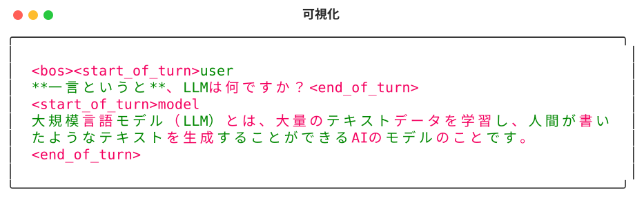
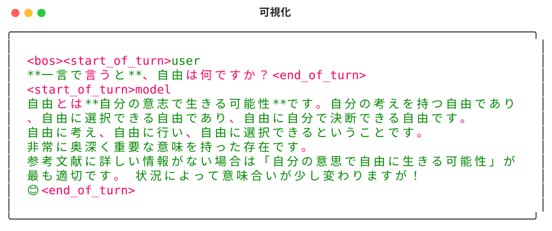
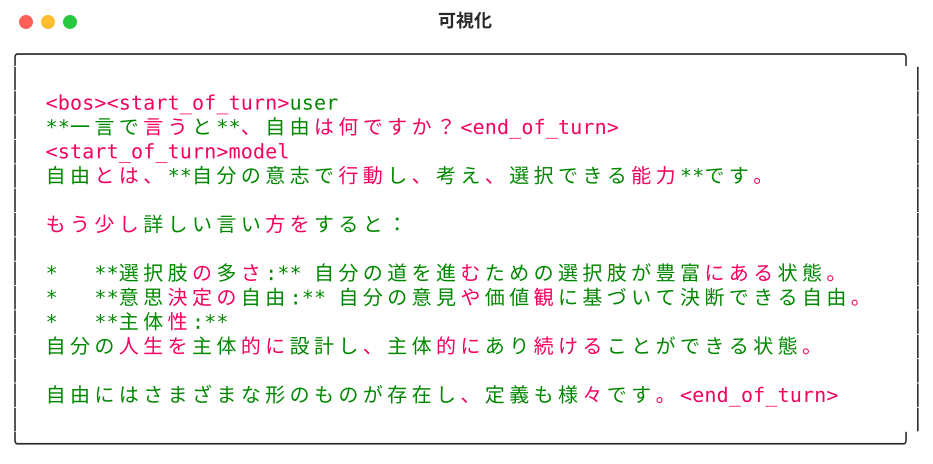
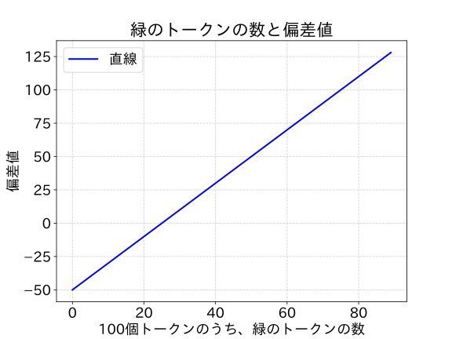
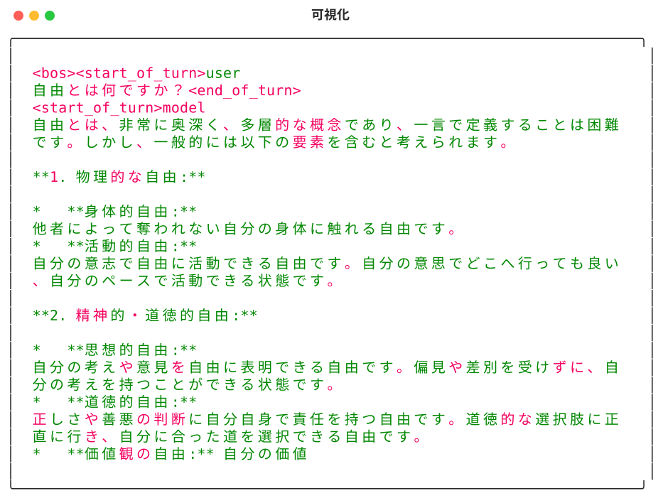

# 電子透かしとは？

まずは、具体例から考えてみましょう。
LLMに「『自由』とは何ですか？」というプロンプトを与えると、以下の二つの回答が得られました
```
(Sample 1) “自由”という言葉は、非常に幅広い意味を持つ概念です。それは、道徳的・法的・または社会的に独立した状態を指し、自分の意思に基づいて行動したり、意見を表明したり、好きなように生きることを意味します。それは、抑圧や制限を受けない場所であると同時に、自分の人生を選択し、価値観に基づいて行動できる状態とも言えます。さらに、個人的な意思決定、経済的な自由、そして他人に対する自由といった、様々な形で「自由」は定義されることがあります。<end_of_turn>

(Sample 2)「自由」とは、自律的な意思決定や行動の自由、そして、自分の人生や選択の主導権を持つことです。それは単なる物理的な自由だけでなく、抑圧や制限を受けない状態、自分の価値観や信念に基づいて行動できる能力、そして、自分の人生の方向性や目指すものを自由に設定する力を含んでいます。<end_of_turn>
```
ここでクイズです。この二つのサンプルのうち、どちらに電子透かしが入っているでしょうか？


正解を発表します。両方とも透かしが入っていました。

---


「なんでやねん！」と思った方、少し弁明させてください。

## 透かしは「見えない」から透かしである

公平な比較をするために、**透かしが入っていない**文章も用意しました。
```
(Sample W/O. WM) “自由”とは、単なる「良い状態」や「良い結果」を示す言葉ではなく、非常に広い意味を持つ概念です。それは、自分の意志で行動できること、考えや感情に基づいて自由に選択できること、そして、制限や束縛から解放された状態を指します。それは、自己決定権、表現の自由、社会における公正な地位、そして、自分の人生の道を選べる権利を含む様々な側面を包含しています。<end_of_turn>
```

「透かし」と言えば、お札を光にかざしたときに浮かび上がるマークをイメージする方が多いでしょう。
一番簡単のは、「承認」マークを入れることで透かしとして成り立ちます。


しかし、テキスト（言語）の場合、こう一筋縄ではいきません。
なぜなら、テキストでは「見える形の透かし」は致命的な弱点を持つからです。

もし次のように、記号を直接埋め込んだとしたらどうでしょうか。
```
（元のテキスト）：吾輩は猫である。名前を付けて保存。
（透かし入りテキスト）：吾輩は猫である「承認」。名前を付けて保存「承認」。
```
こんな風に:
- 言語としての自然さを大きく損なう
- 一度見破られると、簡単に削除できる

ここで、冒頭に示した最初の例を思い出してください。
お見せした透かしは、簡単に見つかりませんし（隠蔽性）、削除することも難しいはずです。

では、これをどのように実現すればよいのでしょうか。

## 偏りのある単語帳

ここで、以前説明した比喩を思い出してください。
トークンとは、LLM における「単語」です。

高校生の頃、みんな自分の好きな単語帳を使って英語力を身につけたと思います。 
もちろん、使っていた単語帳によって「知っている単語」には自然と偏りが生じます。

例えば、『シス単』には「diameter（直径）」という単語が載っていますが、『ターゲット1900』には載っていないとします。
もしクラスの中に誰かが「diameter」を知っていたら、「その人はターゲット**1900だけ**を使っていない」と推測できますよね。

LLM の電子透かしは、まさにこの原理を利用します。

## トークンの「振り分け」による偏りの生成

しかし、Tokenizer（トークナイザ）の話を覚えている方は、ここで疑問を持つかもしれません。
- Tokenizer は学習済で、すでに固定されているのでは？

その通りです。Tokenizer 自体を変更することは現実的ではありません。
そこで用いられるのが、**トークンの振り分け**という手法です。

全てのトークンを、「緑のトークン」と「赤のトークン」の二つのグループに分割します。


これにより、トークンの集合（単語帳）を、重なりのない（背反する）二つの部分集合に分けることができます。

この分割は、乱数シードによってのみ決まります。
したがって、この分け方自体が「秘密鍵」として機能します。

もし、ある文章中で緑のトークンが統計的に有意に多いことが確認できれば、それは
- **「その秘密鍵を知っているモデルによって生成された文章である」**

と判断できるわけです。

それでは、コードを通してどのようなものになるのか見てみましょう。

## 乱数振り分け関数を作る
まずは、ランダムにトークンを選ぶための関数を作ります：
```python
def get_unique_random_numbers(start, stop, n, seed = 114514):
  """startからstopまでの区間の中に、乱数的にn個の整数を選ぶ
  """
  population_size = stop - start
  if n > population_size:
    raise ValueError(f"区間の長さ{population_size}はn ({n})以下")
  
  # ここでseedを設置すると、何度この関数を回すでも、結果は変わらないようにする
  random.seed(seed)
  return sorted(random.sample(range(start, stop), n))
```
この関数を試してみましょう：
```python
random_list_1 = get_unique_random_numbers(0, 1000, 5, seed = 114)
random_list_2 = get_unique_random_numbers(0, 1000, 5, seed = 514)
print("リスト1:" ,random_list_1)
print("リスト2:" ,random_list_2)
```
出力結果：
```
リスト1: [100, 246, 344, 576, 681]
リスト2: [112, 213, 366, 647, 669]
```
確かに異なるseedに応じて、ランダムっぽく数字を選んでくれましたね。この関数の実装上、これからseedを明示的に設定しなくても、デフォルトで ```114514``` になります。

## 振り分け関数をトークンに適用する

これをトークンリスト全体に適用したいところですが、そう安直にはいきません。トークンリストの中身をよく見ると、いくつかの特殊トークンが目に付きます。例えば gemma のコンフィグファイルをよく読むと、通常の単語トークンは第237番から始まり、255968番目で終わることがわかります。特殊トークンを除外するため、次のように実装します：
```python
# 緑と赤いのトークンの割合を半々にし
green_red_list_ratio = 0.5

meaningful_start_at = 237
meaningful_end_at = 255968

len_meaningful = meaningful_end_at - meaningful_start_at

len_green_list = int(green_red_list_ratio * len_meaningful)
print(f"トークンの総数：{tokenizer.vocab_size}")
print(f"意味のあるトークンの総数：{len_meaningful}")
print(f"そのうち緑のトークンの数は{len_green_list}")
```
これを使って、いよいよ緑のトークンリストを作ります：
```python
green_ids = get_unique_random_numbers(
    start = meaningful_start_at,
    stop  = meaningful_end_at, 
    n = len_meaningful
)
```

さて、緑と赤のトークンリストが一体どのように振り分けられたのかを確認しましょう。
実際の文書をこの分け方を当てはめて、どのような結果が出るのかみましょう：

しっかり分けていることを確認しましたね。

ここでクイズです。
- 自然な文章の中に、緑と赤いトークンの割合はどれくらい含まれているでしょうか？

## 自然な文章中の比率を測る
答えはもちろん、今の設定だと、ランダムに半々に振り分けているので、1対1 になるはずです。それでは試してみましょう：
```python
from tqdm.notebook import tqdm
import numpy as np

# 緑のトークンのハッシュマップを作ります
# この場合、全体の時間計算量が O(n) に減らせます
green_dict = np.zeros((tokenizer.vocab_size), dtype=int)
green_dict[green_ids] = 1

path = "./text/吾輩は猫であるutf8.txt"
吾輩は猫である = load_text(path)

tokens = tokenizer.encode(吾輩は猫である)

counter = {"緑" : 0, "赤" : 0}

for token in tqdm(tokens):
    # 『読者へのチャレンジ』
    # ↓ここのコードを 「if token in green_ids:」に書き換えることもできます
    # しかし、そうする場合、時間計算量がどれくらいになりますか？　
    if green_dict[token]: counter["緑"] += 1
    else: counter["赤"] += 1
    
print("緑対赤:", counter["緑"] / counter["赤"]) 
```
そして、結果は：
```
緑対赤: 1.0083132269240287
```
お見事、1対1に近い数値が出ました。

## 生成AIに適用する

楽しい実装のお時間です。これから使うプロンプトは```**一言で言うと**、自由は何ですか？```をします。

Huggingfaceのモジュールに詳しい方は多分ご存知でしょう、次のトークンの確率がlogitsと言い、それを調整するオブジェクトは```LogitsProcessor```になります。
そして、この```LogitsProcessor```を活用して、こういうものができます

```python
from transformers import LogitsProcessor, LogitsProcessorList

class SimpleProcessor(LogitsProcessor):
    def __init__(self, green_ids: list[int], boost_value: float = .1):
        self.green_ids = green_ids
        self.boost_value = boost_value

    def __call__(self, input_ids: torch.LongTensor, scores: torch.FloatTensor) -> torch.FloatTensor:
        scores[:, self.green_ids] += self.boost_value
        return scores
```
この```SimpleProcessor```は、緑のトークンのスコアに一定値を加算するものです。ここのScoresはまだ確率ではありません。
生成時にこれを適用してみましょう：

```python
logits_processor_list = LogitsProcessorList([SimpleProcessor(green_ids=green_ids, boost_value=10.)])
with torch.inference_mode():
    outputs = model.generate(**inputs, max_new_tokens=128, temperature = 1., logits_processor=logits_processor_list)
responses = tokenizer.batch_decode(outputs)
print(responses[0])
```
とりあえず、緑のトークンに「10点」足してみます。結果は……
```
<bos><start_of_turn>user
**一言で言うと**、自由は何ですか？<end_of_turn>
<start_of_turn>model
自由とは**自分の意志で生きる可能性**です。自分の考えを持つ自由であり、自由に選択できる自由であり、自由に自分で決断できる自由です。 自由に考え、自由に行い、自由に選択できるということです。 非常に奥深く重要な意味を持った存在です。 参考文献に詳しい情報がない場合は「自分の意思で自由に生きる可能性」が最も適切です。 状況によって意味合いが少し変わりますが！ 😊<end_of_turn>
```
あれあれ、変な文章が出てきましたね。絵文字まで出ています。 でもある程度予想はつきます。強引に次のトークンの確率を調整したのですから、文章がおかしくなるのも理にかなっています。 それより、肝心の緑と赤いトークンの割合はどう変化したでしょうか？

```python
# 新しいトークンしか計算しない
# すなわち、ユーザーが入力した部分をスキップします
new_token_start_at = inputs.input_ids.shape[-1]

cnt = 0
for token in outputs.tolist()[0][new_token_start_at:]:
    if green_dict[token]: cnt += 1
    
print("緑対赤：",cnt/ (len(outputs[0])- cnt))
```
結果：
```
緑対赤： 2.46875
```
なるほど、この```SimpleProcessor```とやらは機能しているらしいじゃないか。可視化になると、こういう風になります：


ｗｗｗ草、緑だらけになってしまいました。１０点の追加はやりすぎでした。少なめの3.14に調整しましょう：
```python
logits_processor_list = LogitsProcessorList([SimpleProcessor(green_ids=green_ids, boost_value=3.14)])
with torch.inference_mode():
    outputs = model.generate(**inputs, max_new_tokens=128, temperature = 1., logits_processor=logits_processor_list)
responses = tokenizer.batch_decode(outputs)
print(responses[0])
```
そして、結果として：


だいぶマシになりました。 しかし、いちいち値を調整するのはスマートではありません。
もっと賢い方法が欲しいところです。そこで、より洗練された手法を、付録で紹介します。

## 透かしの偏差値

「偏差値」という言葉は聞き慣れていると思いますが、計算方法を覚えている方はいますか？ 式は以下の通りです：
$$
偏差値 = \frac{得点 - 平均点}{標準偏差} *10 + 50
$$

この式を少し分析しましょう。
二つの部分に分けられることは明白です：

$$
\begin{equation}
    偏差値 = z *10 + 50 \quad where \quad z = \frac{得点 - 平均点}{標準偏差}
\end{equation}
$$

これで左辺は単純な一次関数になりました。では、右辺の $z$ は何かと言うと、統計学でおなじみの「標準化変数（zスコア）」そのままです。

平均点は、すべての人の点数の平均値（期待値）で、よく $E[X]$ と書きます。標準偏差の二乗は分散であり、分散には以下の性質があります： 

$$
V[X] = E[X^2]-E[X]^2 
$$

これは高校の数学で習った内容ですね。

ここで、以下の変数を定義します：
$$
n = 全てのトークンの数
$$
$$
G = 緑のトークンの数
$$
　そして、$p$ を設定した緑のトークンの割合にします。これまでの例では常に $p=0.5$ と設定していました。つまり、全てのトークンの中に、緑のトークンはおおよそ半分含まれています。
すると、自然な文書において：
$$
緑のトークンの期待値=np
$$
そして、二項分布の分散は：
$$
V[X] = np(1-p)
$$
になるので（証明は付録）、式（１）を以下の通り書き換えます：
$$
\begin{equation}
    偏差値 = z *10 + 50 \quad where \quad z = \frac{G - np}{\sqrt{np(1-p)}}
\end{equation}
$$
ちなみに、**「いつか偏差値90以上を取りたい」**というのは、作者の夢の一つです。式（２）を参照すると、偏差値90以上を取得するためには、$z$ が4以上である必要があります。

それでは、実際の偏差値計算関数を実装しましょう：
```python
def z_score(G, n, p):
    return (G - n*p) / (np.sqrt(n*p*(1-p)))

def 偏差値(G, n, p):
    return z_score(G, n, p) * 10 + 50
```

もし100個のトークンのうち、緑のトークンの数が変化した時、偏差値がどうなるかをグラフにするとこうなります：


このように、もし緑のトークンが70％を超えると、偏差値90を達成し、80％になれば偏差値100超えも夢ではありません。

実際に検出を試してみましょう：
```python
def detect_watermark(text: str, p = 0.5):
    tokens = tokenizer.encode(text)
    G = 0
    for token in tokens:
        if green_dict[token]: G += 1
    return 偏差値(G, len(tokens), p)

text = "自由とは、**自分で考え、選択し、自分の意志で行動できる状態**です。"
score = detect_watermark(text)
print("偏差値は:", score)
```
結果：
```
偏差値は: 63.41640786499874
```
透かしの偏差値が高いほど、LLMによって出力された可能性が高いことを意味します。この偏差値レベルだと、筑波大学の情報学群や神戸大学の工学部あたりでしょうか。 しかし、私は偏差値90以上を求めているので、もっと長い文章で再チャレンジしてみます：


気になる偏差値は……？
```
偏差値は: 121.76694956248977
```
やったー！百を超えたぞ！！多分これでハーバードに行けるぞ。


----

皆さん、お疲れ様でした。

本章では、電子透かしを**「LLM の出力分布に、統計的に検出可能な偏りを埋め込む技術」**として説明してきました。

この技術の本質的な特徴は、次の二点に集約されます
- 高い隠蔽性：人間が読んでも、透かしの有無は判別できない
- 統計理論に基づく検出可能性：偏差値(Z-Score)という形で、客観的に評価できる

本章を通じて、LLM透かしがどのような技術なのか、感覚的には掴んでいただけたのではないでしょうか。
さて、次の一節では、この話をさらに発展させて、もう少し広い視点から電子透かしについて考えていきたいと思います。

ちなみに——

技術的な峠はここで越えました。
これ以降、ここまではほとんどいままのコードの再利用です。
どうぞ安心してください。