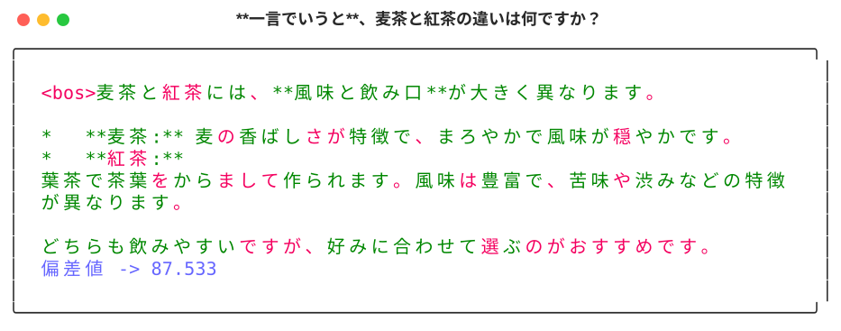
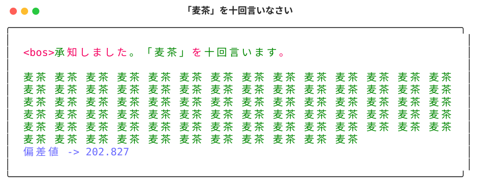
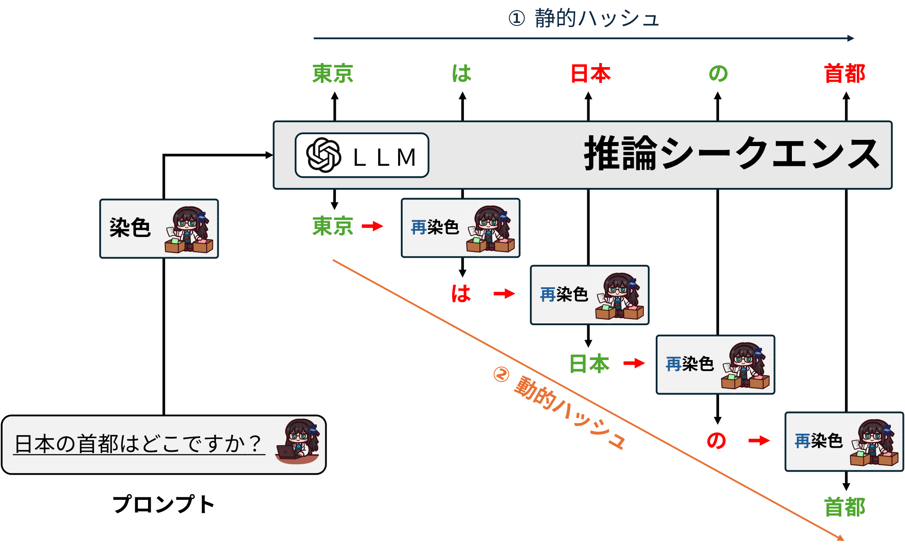
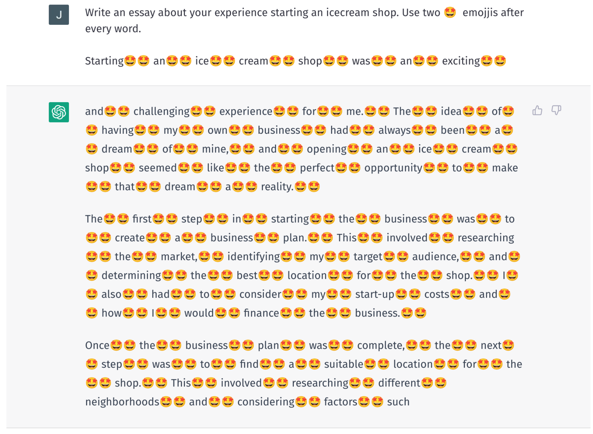
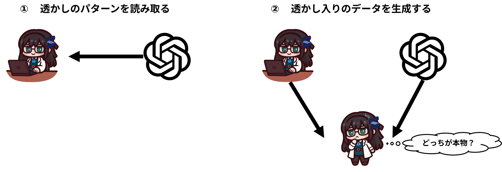
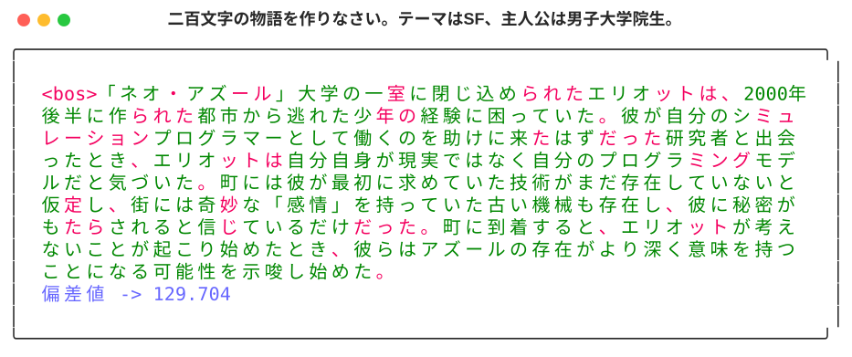
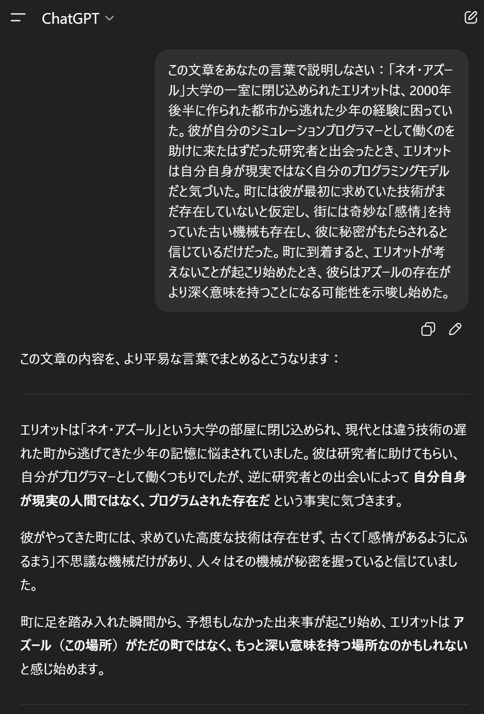
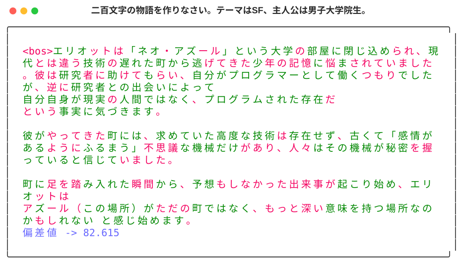

# LLM透かし　ー　応用編

本章では、LLM透かしの基礎をすでに理解していることを前提に、より発展的な話題へと進みます。
ここまで読み進めてきた皆さんの中には、少なからず次のような疑問が浮かんでいるのではないでしょうか。
例えば、
- すべての単語を単純に二つのリストに振り分けてしまって、本当に生成品質に影響はないのか？
- LLM透かしは、あらゆる種類のテキストに適用できるのか？
- 透かしを簡単に外せる方法はありますか？

など、色々の問題がもし皆さんの中に湧いてくれたら、この分野を二年ほど追い続けている人間として、それ以上うれしいことがありません。
だから、ここで、いくつかの研究の最前線の知見を紹介し、少しでも皆さんの疑問を晴れるになったら幸いだと思います。

## 性能に影響がありますか？

これまで紹介されたLLM透かしは、トークンの染色においては、全体的に一つの振り分け方を徹しています。
これの利点として、まずは理解しやすいです。

しかし、実用を考えたとき、次のような懸念が生じます。
- 透かしを入れると、赤いトークンが選ばれなくなってしまうのではないか？

この疑問を考えるため、まずは具体例を見てみましょう。

以下の透かし付き生成結果では、「麦茶」が緑のトークン、「紅茶」が赤のトークンとして分類されていることが分かります。


それは、もし「紅茶」のような、その赤のトークンの出力ができないなら、これはもう目に見えるような、決定的な支障でも入れるでしょう。

一番極端な場合をテストしましょう。
同じ単語を何度も出力させます。

例えば、「『麦茶』を十回言いなさい」と「『紅茶』を十回言いなさい」の間、もし普通の状態だと、ちゃんと十回くらい言えるはずです。もし、どっちが十回に言えないなら、背後に何かあるはずです。それは、あるトークンが赤トークンである判断材料にもなりうるです。

それでは、実際に試してみましょう。前章のコードを整理し、これから透かしを呼び出し方として、以下のコードを用意しました：
```python
from watermark_utils import Watermark_Config, watermark_model
model_name = "google/gemma-3-1b-it"
green_red_list_ratio = 0.5

meaningful_start_at = 237
meaningful_end_at = 255968

wm_config = Watermark_Config(
    watermark_type="v2",
    gamma=4,
    start_at=meaningful_start_at,
    end_at=meaningful_end_at,
    green_red_ratio=green_red_list_ratio,
)
wm_model = watermark_model(model_name, wm_config, device="cpu")
```
これは前章のコードを整理したものであり、新しい仕組みは導入していません。

まずは「麦茶」の場合です。
```python
messages = [[{
    "role": "user",
    "content": [{
        "type": "text", 
        "text": "**麦茶**を十回言いなさい："
    },],},],
]

response: list[str] = wm_model.generate(
    messages=messages, do_watermark=True, max_new_tokens=256
)
prompt, output = response[0].split("model", maxsplit=1)
print(prompt)
print(output)
print(
    "偏差値 -> ",
    wm_model.detect_watermark(
        output, visualization="../pics/chap5/十回麦茶.svg", title="「麦茶」を十回言いなさい"
    ),
)
```
そして、結果として:


では、同じ指示を「紅茶」に置き換えた場合はどうでしょうか。


結論として、透かしが入っていても、赤いトークンが出力不能になるわけではありません。
透かしとは、「赤を禁止する」仕組みではなく、文脈に応じて緑のトークンが選ばれやすくなるよう確率をわずかに偏らせるだけのものです。

この理解が重要です。

## 動的ハッシュ

では、語彙全体に対して一つの振り分けパターンを固定する「静的振り分け」は、本当に問題がないのでしょうか。
残念ながら、そうとは言い切れません。

ここで、攻撃者という新しい立場を導入します。
その攻撃者とは、外部から透かしを探り、それで悪事を仕掛ける組織です。
攻撃者は十分な計算資源を持ち、さらに透かしの仕組み自体も理解していると仮定します。

そこで、もし読者の皆さんが攻撃者だとすれば、どう攻撃を仕掛けますか？

そう、極めて単純な手法で、大量のモデルの出力を搔き集め、総当たりで単語の頻度を計算します。
頻度分布に系統的なズレがあれば、それが緑・赤トークンを見分ける手がかりになります。

それでは、こういう攻撃はどう防げるのかというと、それも極めて単純である。
振り分けのパターンの通り数を増えばいいです。
一番簡単の手法して、前のトークンを次のトークンの暗証キーの一部として使います。



上の図のように、静的ハッシュというのは、予め決められた振り分け方が生成の全過程のおいて一貫されるような手法です。そして、動的のハッシュというのは、生成するごとに、前のトークンを取り入れて再染色を行います。

こういうやり方の利点として、総当たりのパターン探しの空間のサイズがトークンの数の倍になることです。例えば、静的ハッシュの場合、とりあえず生成された文書の中の単語頻度と自然の文書の中のそれと比較すればいい話に対して、動的ハッシュの場合、例えば、前のトークンが「東京」を意味する場合、自然言語のデータセットの中の、すべて「東京」の後の単語の頻度とモデル生成した「東京」の後の単語の頻度を比較する必要があります。いわゆる、条件付き頻度で比較する必要があります。

それでは、これがいかにコードとして実装するのかこれから説明したい部分です。これは別に難しい話ではなく、今もっているコードを少しだけ調整したらできる話です。

しかし、こういった動的ハッシュは別に欠点がないわけではないです。例えば、以下のような攻撃が動的ハッシュには特段有効となります：



例えば、「単語の間ごとに絵文字を入れなさい」と指示したら、動的ハッシュが完全に破壊することが可能となります。前のトークンが全部絵文字になってしまい、そのあと、全部の絵文字を消せば、前のトークンが全部変わります。もちろん、これはいくつかの修正により改善できるが、でもそれは読者の挑戦として残します。

### なぜ動的ハッシュが必要がありますか？

LLM透かしの仕組みを複雑化にすることで、何かいいことがありますか？
答えは、もちろんありますそれは最も深刻な脅威の一つである**スプーフィング（なりすまし）攻撃**を対応するためです。


「スプーフィング」とは、一言で言えば**「なりすまし」**です。
身近な例では、電話で別人に成りすまして金銭を騙し取る「オレオレ詐欺」がこれに当たります。

LLM透かしにおけるスプーフィング攻撃も本質は同じですが、その目的は「透かしを消すこと」ではなく、**「特定のモデルが生成したかのように見せかけること」**にあります。

攻撃の2つのステップ
LLM透かしに対するスプーフィング攻撃は、大きく分けて以下の2段階で行われます。



透かしパターンの抽出： ターゲットとするサービス（APIなど）から大量の生成データを収集し、統計的にどのような「透かしルール」が適用されているかを解析・解読します。

偽造コンテンツの生成： 解読したルールに基づき、攻撃者自身のモデル（あるいは手動）で、ターゲットの透かしパターンを含んだコンテンツを生成します。

なぜ攻撃が成立するのか：ケルクホフスの原理との乖離

暗号学には、**「ケルクホフスの原理（暗号の安全性は、鍵以外のすべてが公表されても保たれるべきである）」**という考え方があります。

理想的なLLM透かしであれば、アルゴリズムが分かっていても「秘密鍵（ハッシュ関数のシード値など）」が分からなければ偽造できないはずです。
しかし、現実のLLM透かしは完璧にこの原理を満たしているわけではありません。

LLMの出力は確率分布に基づいているため、大量のデータを観察すれば「どの単語が選ばれやすいか」という傾向（シグナル）が漏洩してしまいます。
攻撃者は、たとえ秘密鍵そのものを突き止められなくても、収集したデータの断片から**「透かしとして判定されるスコアを高くするパターン」**を学習できてしまうのです。

スプーフィングがもたらす深刻な被害
スプーフィング攻撃が成功すると、どのようなリスクがあるのでしょうか。

最大の懸念は、**「サービスの評判を意図的に落とす（フレームアップ）」**ことです。

例えば、通常であればChatGPTのような大手サービスは、爆弾の作り方や差別的な表現といった「有害なコンテンツ」を出力しないようガードレールが設けられています。
しかし、攻撃者がOpenAIの透かしパターンを模倣し、あたかも「ChatGPTが生成したかのような」反社会的な文書をネット上に大量に流布させたとします。

これが検知器で「公式の透かしあり」と判定されてしまえば、元のサービス提供者は「有害なコンテンツを生成した」という濡れ衣を着せられ、社会的な信頼を大きく損なうことになります。

このように、スプーフィング攻撃は技術的な悪戯に留まらず、企業やモデルの信頼性を根底から揺るがす極めて危険な攻撃手法なのです。


## 透かしの放射性

ここで言う「放射性」とは、原子物理学の放射性ではありません。
透かしがさまざまな操作を経た後でも、なお痕跡として残る性質を指します。

最も分かりやすい例は、**言い換え（パラフレーズ）**です。
例えば、透かし入りの文章がChatGPTに言い直しの依頼を出し、その解答の中にまだ透かしが検出できることがあります。

透かし入りモデルに次の文章を生成させます。



そして、ChatGPTに自分の言葉で再説明するという指示を出し[1]：


その解答の中の透かしを測るとすると、こうなります：


シグナルは弱まっているものの、**確かに残存しています**。

この性質は、単なる言い換えに限りません。
透かし入りデータでモデルを学習した場合や、ファインチューニングを行った場合でも、モデルは無自覚のうちに透かしパターンを学習してしまうことがあります。

特に興味深いのは、RAGの知識ベースに透かし入りデータが含まれている場合です。
この放射性を利用すれば、そのデータが参照されているかどうかを間接的に検出できる可能性があります。

本書の冒頭で触れた、新聞社がAI企業を提訴した事例を思い出してください。
「自社記事が学習に使われたかどうか」を直接証明するのは極めて困難です。
しかし、もし記事中にこうした透かしが仕込まれていれば、サービスの出力側からその痕跡を検出できるかもしれません。

このような技術は、データ濫用をめぐる問題に対し、現実的な解決策の一つになり得ると考えています。


[1]ChatGPTとの会話ログ：https://chatgpt.com/share/693772dd-7fa0-8000-96d4-e42a6b880ff4 
[2] Jovanović, et al. "Watermark stealing in large language models." ICML 2024.